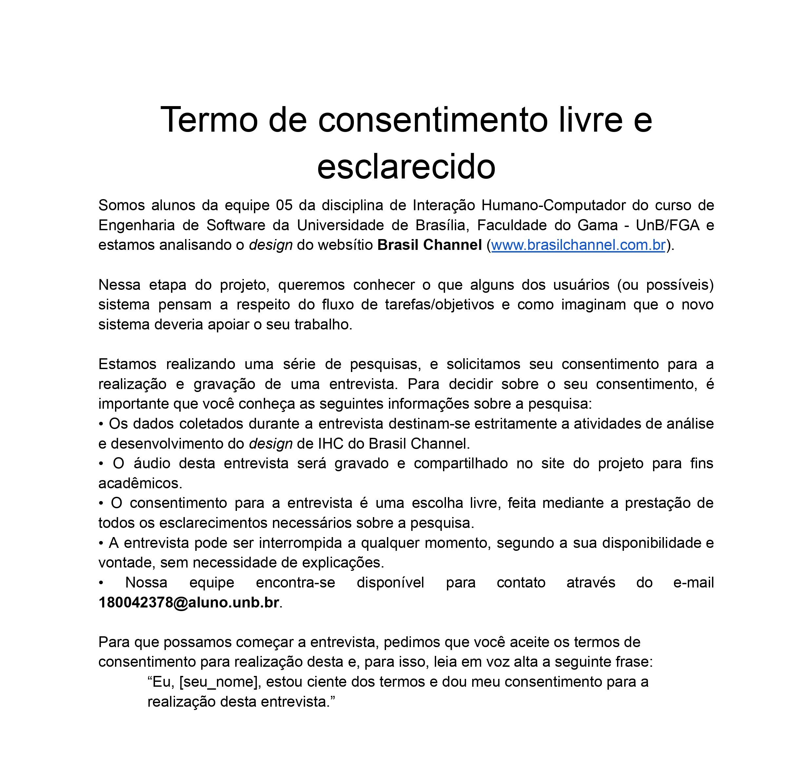

# Planejamento da Avaliação da Análise de Tarefas

## 1. Introdução
&emsp;&emsp;Em etapas anteriores, foi feita a ánalise de tarefas para entender qual é o trabalho dos usuários, como eles o realizam e o porquê. Já nesta etapa, queremos coletar informações e opiniões nos pontos de vistas quem utiliza um sistema interativo (o usuário).

## 2. Objetivo da Avaliação
&emsp;&emsp;A avaliação tem como objetivo principal verificar se o sistema apoia adequadamente os usuários a realizarem as tarefas identicadas na ánalise em um contexto de uso real (Barbosa e Diniz, 2010). Com os resultados poderemos validar quais funcionalidades devem ser incluídas no produto, quais devem ser retiradas, aprimoradas, quais fatores são prioridades, etc.

## 3. Metodologia
&emsp;&emsp;Para fazer a avaliação, optamos por usar o Framework **DECIDE**, proposto por Sharp, Rogers e Preece (2007) e citado por Simone Barbosa (2010), para que possamos planejar, executar e analisar esta avaliação.

&emsp;&emsp;Este Framework busca descrever atividades interligadas e executadas iterativamente, à medida que o avaliador articula os objetivos da avaliação, os dados e recursos disponíveis. Sendo assim, as atividades do Framework são:

- **D**: Determinar os objetivos da avaliação.
- **E**: Explorar perguntas a serem respondidas com a avaliação. 
- **C**: Escolher (Choose) os métodos de avaliação a serem utilizados.
- **I**: Identificar e administrar questões práticas da avaliação.
- **D**: Decidir como lidar com questões éticas.
- **E**: Avaliar (Evaluate), interpretar e apresentar os dados.

## 4. Método para a Avaliação
&emsp;&emsp; Para a realização da Avaliação da Análise de Tarefa, optamos por utilizar um método de investigação, para que possamos ter acessso, interpretar e analisar opiniões e expectativas do usuário. Dessa forma, dentre os métodos de investigação, escolhemos a realização de **entrevistas** com usuários ou potenciais usuários do sistema.

&emsp;&emsp; No quesito da identificação e administração das questões práticas da avaliação, o grupo irá focar em encontrar usuários ou potênciais usuários do sistema baseando-se no [Perfil de Usuário](../analiseRequisitos/perfilUsuario.md) definido durante a etapa de Análise de Requisitos do projeto. E para isso, iremos divulgar a entrevista em grupos de aplicativos de mensagens que julguemos serem condizentes e depois iremos filtrar os interessados com base no Perfil de Usuário. Além disso, faremos convites diretos à pessoas que saibamos que se encaixam nas características que buscamos. Porém, no caso de grandes dificuldades em econtrar estes usuários, iremos conduzir estas entrevistas com as [Personas](../analiseRequisitos/personas.md), também definidas na Análise de Requisitos, através da técnica de Role Playing.

## 5. Entrevista
&emsp;&emsp; A entrevista trata-se de uma conversa entre duas ou mais pessoas (um ou mais avaliadores e um entrevistado, ou seja, aquele que irá responder as perguntas) com o objetivo de responder perguntas que satisfazem o objetivo da avaliação (verificar se o sistema é eficiente). Para auxiliar na entrevista, montamos um roteiro, para guiar o fluxo da conversa.

&emsp;&emsp; Primeiro o(s) avaliador(es) deve explicar o objetivo da pesquisa ao entrevistado e responder todas as suas dúvidas sobre como acontecerá a coleta de dados, sua interpretação e divulgação, além de garantir a confidencialidade ao participante. Depois deve mostrar o termo de consentimento ao participante (Figura 5.1) e, se este concordar e assinar, começar as **perguntas**. Por fim, agradecer a presença do participante e perguntar se ele tem mais alguma dúvida ou sugestão que não foi abordada nas perguntas.

<figcaption align='center'>
    <b>Figura 5.1: Termo de Consentimento.</b>
     <small>Fonte: Elaboração própria.</small>
</figcaption>

### 5.1. Perguntas

| Número | Pergunta |  Resposta Esperada |
|:--:|:--:|:---|
| 1 | Qual seu nome? | - |
| 2 | Qual sua idade?  | - |
| 3 | Qual seu nível de formação? | ( )Ensino Fundamental Incompleto   ( )Ensino Fundamental Completo   ( )Ensino Médio Incompleto   ( )Ensino Médio Completo   ( )Ensino Superior Incompleto   ( )Ensino Superior Completo   ( )Pós Graduado   ( )Mestrado  ( )Doutorado |
| 4 | Você já havia acessado o site do Brasil Channel? | ( )Sim   ( )Não   ⚠️ Caso a resposta seja não, pule para a pergunta 6 |
| 5 | Como você faz para procurar o que está interessado? | ( )Olha o menu lateral e decide qual tópico se aproxima mais do que procura   ( )Outra maneira? Como? |
| 6 | Qual sua maior dificuldade ao utilizar o site do Brasil Channel? | ⚠️ Caso a resposta seja haja dificuldades, pule para a pergunta 8 |
| 7 | O que você acredita que poderia ser feito para resolver essas dificuldades? | - |
| 8 | Qual funcionalidade você gostaria que existisse no site? | - |
| 9 | Para você, como um site sobre assuntos gerais do Brasil deveria ser? | - |

## 6. Resultados

&emsp;&emsp; As entrevistas realizadas serão documentadas e os dados coletados servirão para uma nova análise de tarefas, de acordo com a visão do usuário final.

---

## Histórico de versões

| Versão |                Alteração               | Autor(es) |         Revisor(es)        |  Data |
|:------:|:--------------------------------------:|:-----------:|:----------------------:|:-----:|
|   1.0  |  Criação do documento |    Kathlyn Lara    | - | 07/08/2022 |

## Referências

- BARBOSA, Simone; DINIZ, Bruno. Interação Humano-Computador, Editora Elsevier, Rio de Janeiro, 2010.

