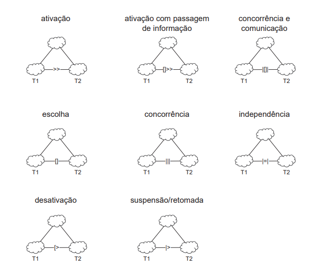
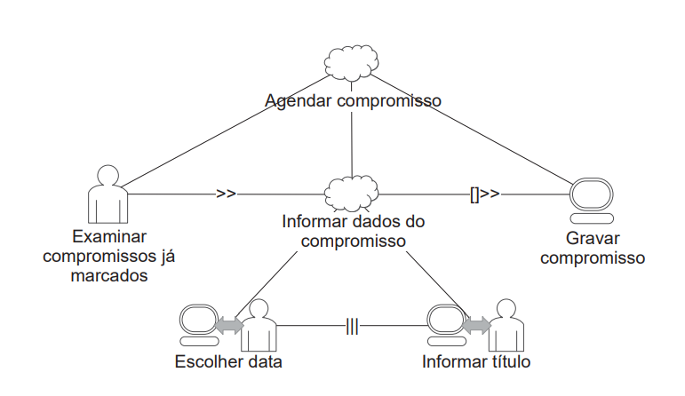

## 1 - Árvores de Tarefas Concorrentes (ConcurTaskTrees - CTT)

&emsp;&emsp; Esse modelo foi criado para ajudar a avaliação do design e a avaliação de IHC (Paterno, 1999). Existem quatro tipos de tarefa para esse modelo, que são elas:  

- Tarefas do usuário: Realizadas fora do sistema
- Tarefas do sistema: O sistema realiza um processamento sem interagir com o usuário
- Tarefas interativas: Ocorre os diálogos usuário com o sistema
- Tarefas abstratas: Uma representação de uma composição de tarefas que auxilie a decomposição

&emsp;&emsp;Parecido com a análise hierárquica de tarefas, os diferentes níveis hierárquicos devem ser lidos como "para considerar T1 como tendo sido realizada, as tarefas T2 e T3 devem tersidos realizadas". Tanto as tarefas como a frase em aspas estão sendo representadas na figura 1.

<small>
Figura 1 - Exemplos de figuras representando as tarefas e suas comunicações entre si no modelo CTT retirado do livro da Simone cap. 8
</small>

&emsp;&emsp;Além disso, o CTT permite representar diversas relações entre as tarefas e os significados dessas relações são:

- Ativação: Significa que a segunda tarefa só pode iniciar após a primeira tarefa terminar (T1 >> T2)
- Ativação com passagem de informação: Especifica que, além de T2 só poder ser iniciada após T1, a informação produzida por T1 é passada para T2 (T1 []>> T2)
- Escolha: Especifica duas tarefas que estejam habilitadas num momento, mas que, uma vez que uma delas é iniciada, a outra é desabilitada (T1 [] T2)
- Tarefas concorrentes: Especifica que as tarefas podem ser realizadas em qualquer ordem ou ao mesmo tempo (T1 ||| T2)
- Tarefas concorrentes e comunicantes: Especifica que, além de as tarefas poderem ser realizadas em qualquer ordem ou ao mesmo tempo, elas podem trocar informações (T1 |[]| T2)
- Tarefas independentes: Especifica que as tarefas podem ser realizadas em qualquer ordem, mas quando uma delas é iniciada, precisa terminar para que a outra possa ser iniciada (T1 |=| T2)
- Desativação: Especifica que T1 é completamente interrompida por T2 (T1 [> T2)
- Suspensão ou(e) retomada: Especifica que T1 pode ser interrompida por T2 e é retomada do ponto em que parou assim que T2 terminar (T1 |> T2)

  
A figura 2 apresenta um exemplo de cada uma das relações:

<small>
Figura 2 - Exemplos de figuras representando as relações entre as tarefas no modelo CTT retirado do livro da Simone cap. 8
</small>

Uma das vantagens do CTT é com relação a outros modelos de tarefas, é destacado a possibilidade do registro explícito das relações entre tarefas, entretanto com relação a modelos especificamentes projetados para a interação é a ausência de elementos destinados à representação de mecanismos de prevenção e tratamentos de erros na interação do usuário com o sistema. Na figura 3 está representada um exemplo de modelo CTT de análise de tarefa para um objetivo de marcar um compromisso em uma agenda, retirados do livro da Simone no cap.8 página 189.

<small>
Figura 3 - Exemplo de modelo CTT de análise de tarefa para um objetivo de marcar um compromisso em uma agenda retirado do livro da Simone cap. 8
</small>

## 2 - Análise de desempenho do web site Brasil Channel com o CTT

&emsp;&emsp; Foi aplicado o modelo de análise de tarefas CTT, sendo o objetivo acessar a página Litoral.

&emsp;&emsp;Como no site avaliado as únicas funcionalidade que ele apresenta é acessar os links, a análise de tarefas CTT demonstra um pouco de dificuldade para obter informações importantes sobre as tarefas descritas. Pois para aplicações com diversas funcionalidade, o CTT seria melhor aplicado e o resultado satisfatório na hora de recolher os dados.  

&emsp;&emsp;Na figura 4 está o modelo CTT representando o objetivo de acessar o Litoral:

<small>
Figura 4 - Modelo CTT seguindo o roteiro apresentado para o objetivo de acessar o Litoral
</small>

## Histórico de Versão

| Versão |                Alteração               | Responsável |         Revisor        |  Data |
|:------:|:--------------------------------------:|:-----------:|:----------------------:|:-----:|
|   1.0  | Criação do documento |    Levi Queiroz   | - | 20/07/2022 |
|   1.1  | Adição do CTT |   Levi Queiroz   | Lucas | 20/07/2022 |
|   1.1  | Correções no artefato |   Levi Queiroz   | - | 20/07/2022 |

## Referências

- BARBOSA, Simone; DINIZ, Bruno. Interação Humano-Computador, Editora Elsevier, Rio de Janeiro, 2010.