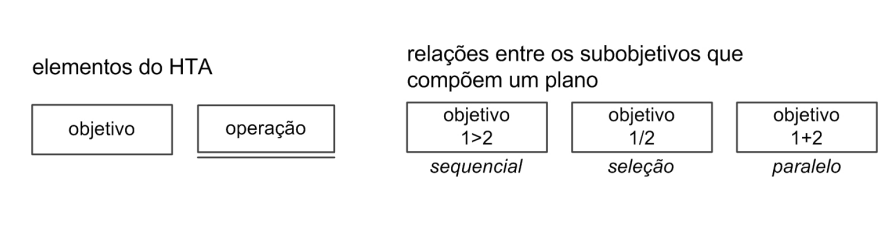

# Análise Hierárquica de Tarefas 

## 1. Introdução
&emsp;&emsp;A análise de tarefas é uma ferramenta de análise de dados realizada por especialistas em usabilidade para entender as etapas do processo de interação do usuário com o sistema.

&emsp;&emsp;Neste documento, a análise será realizada por estudantes do grupo 5 de IHC do curso de Engenharia de Software, UnB.

## 2. Objetivo
&emsp;&emsp;A análise de tarefas tem como objetivo entender sobre qual é o trabalho dos usuários, como eles o realizam, porquê e quais as consequências caso não façam corretamente. Ela pode ser utilizada em diferentes etapas do desenvolvimento, podendo ser realizada em um produto já existente ou um novo produto, utilizando ou não uma ferramenta computacional. O método utilizado na realização da análise deste projeto será a Análise Hierárquica de Tarefas (AHT).

## 3. Metodologia
&emsp;&emsp;Toda tarefa pode ser descrita pelo seu **objetivo**. A partir de um objetivo, precisamos identificar como o usuário realiza, ou seja, mapeamos os **subobjetivos** necessários e criamos um **plano** para definir a ordem em que os subobjetivos devem ser alcançados. Este desdobramento é chamado decomposição de tarefas, e conduz a um conjunto de atividades.

&emsp;&emsp;Além disso, a HTA permite representar diversas relações entre os subobjetivos e os significados dessas relações são:

**Sequencial**: A tarefa 2 só pode ser realizada depois que a tarefa 1 for realizada.

**Seleção**: Ou realiza a tarefa 1 ou realiza a tarefa 2.

**Paralelo**: Pode ser realizado as duas tarefas ao mesmo tempo.

&emsp;&emsp;Para representar graficamente a HTA, é utilizado os seguintes elementos:

<figcaption align='center'>
    <b>Figura 1: elementos para representação gráfica </b>
     <small> Fonte: Aula 09 - Capítulo 06 - Organização do Espaço de Problema – Livro IHC: Barbosa e Silva </small>
</figcaption>

&emsp;&emsp;Para representar a HTA em forma de tabela, é utilizado os seguintes elementos:

| Objetivos / Operações | Problemas e recomendações |
| :-------------------: | :------------------------ |
| X. [objetivo][relação]| Input: [dados de entrada] Feedback: [resultado] Plano: [próximos passos] Problema: [o que pode dá errado] Recomendação: [como corrigir o problema] 

<figcaption align='center'>
    <b>Tabela 1: Modelo para HTA</b>
     <small> Fonte: Elaboração Própria</small>
</figcaption>

&emsp;&emsp;E pode também ser representado de maneira textual, seguindo o seguinte modelo:

**0**. Objetivo 
&emsp;**1**. Subobjetivo 1 para realizar o objetivo 
&emsp;&emsp;**1.1**. Subojetivo 1.1 para realizar o subojetivo 1 
&emsp;&emsp;**1.2**. Subojetivo 1.2 para realizar o subojetivo 1 
&emsp;&emsp;... 
&emsp;**2**. Subojetivo 2 para realizar o objetivo 
&emsp;&emsp;**2.1**. Subojetivo 2.1 para realizar o subojetivo 2 
&emsp;&emsp;&emsp;**2.1.1**. Subobjetivo 2.1.1 para realizar o subobjetivo 2.1 
&emsp;&emsp;&emsp;**2.1.2**. Subobjetivo 2.1.2 para realizar o subobjetivo 2.1 
&emsp;&emsp;**2.2**. Subojetivo 2.2 para realizar o subojetivo 2 

Plano 0: faça 1 - 2 
Plano 1: faça 1.1 - 1.2 
Plano 2: faça 2.1 - 2.2 
Plano 2.1: faça 2.1.1 - 2.1.2 

&emsp;&emsp;Neste documento, iremos utilizar a representação textual da HTA.

## 4. Análise Hierárquica de Tarefas (AHT)

### 4.1 Representação textual 

**0.** Acessar data comemorativas
 &emsp;&emsp;**1.** Acessar "Brasil"
 &emsp;&emsp;&emsp;**1.1** "Data Comemorativas"

Plano 0: faça 1 
Plano 1: faça 1.1

## Histórico de Versão

| Versão |                Alteração               | Responsável |         Revisor        |  Data |
|:------:|:--------------------------------------:|:-----------:|:----------------------:|:-----:|
|   1.0  | Criação do documento |    Pedro Henrique Caldeira   |  Samuel | 19/07/2022 |
|   1.1  | Analíse de tarefas por meio do diagrama |   Samuel Victor Macedo   | Lucas | 20/07/2022 |
|   1.2  | Correção de imagem |   Levi Queiroz  | - | 06/08/2022 |
|   2.0  | Criação da segunda versão do documento | Lara | - | 22/08/2022 |

## Referências

- BARBOSA, Simone; DINIZ, Bruno. Interação Humano-Computador, Editora Elsevier, Rio de Janeiro, 2010. 

- Preece, J.; Rogers, Y,; Sharp, H. Design de Interação. Porto ALegre: Bookman, 2005.