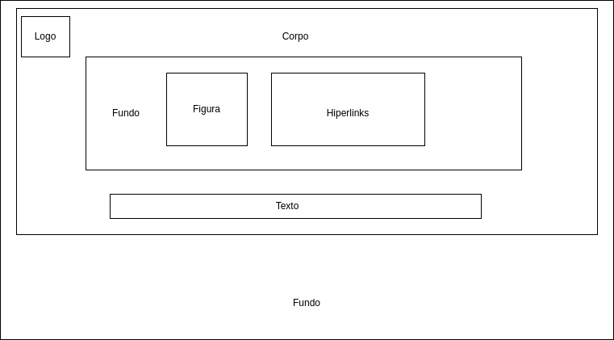
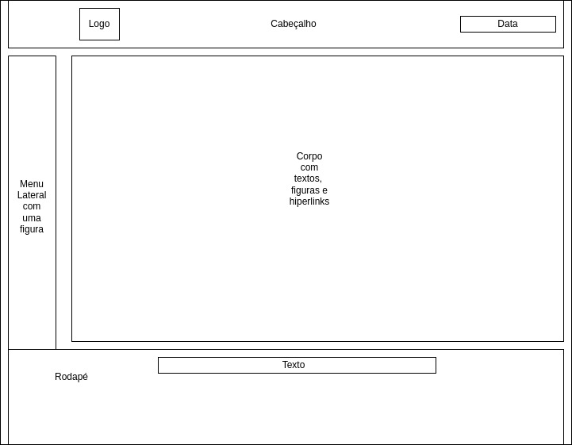
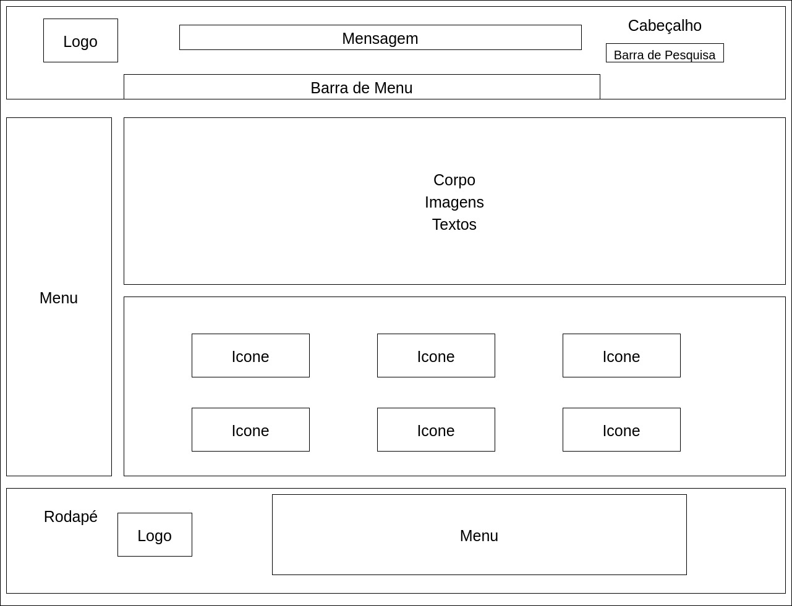
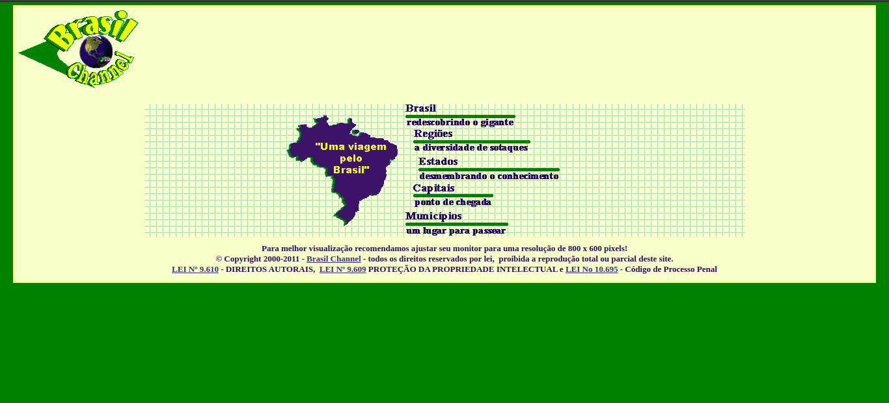
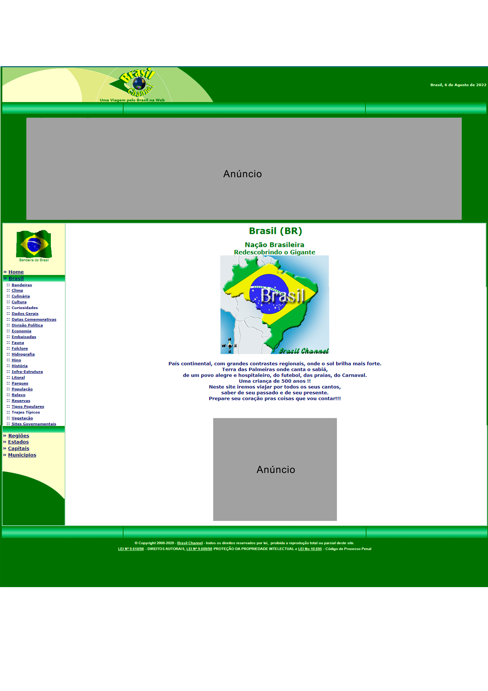
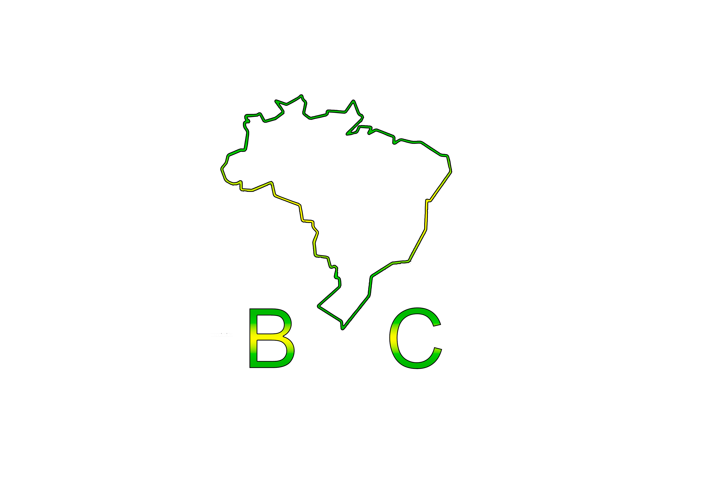

# Guia de Estilo

## 1 - Introdução

&emsp;&emsp;A estrutura do presente guia de estilo é baseado no na estrutura comum apresentado na página 258 do livro da Simone, com referência à Marcus (1991) e Mayhew (1999).

### 1.1 - Objetivo do guia de estilo  

&emsp;&emsp;O objetivo do guia de estilo é registrar as princípais decisões de design tomadas, sendo que não se percam, ou seja, que sejam efetivamente incorporadas no produto final. Serve como uma ferramenta de diálogo entre os integrantes da equipe de design e também com a equipe de desenvolvimento. É importante que as decisões de design possam ser facilmente consultadas e reutilizadas nos debates sobre extensões ou versões futuras do produto.  

### 1.2 - Organização e conteúdo do guia de estilo  

&emsp;&emsp;A organização é baseado no ciclo de vida da Engenharia de usabilidade de Mayhew, em que os princípios do guia estão de acordo com as metas de usabilidade e que possam ser verificadas durante a utilização deste artefato. Incorporando as decisões de design envolvendo os principais elementos e considerações de design de interface. Marcus (1991) considera os seguintes elementos:

- Layout:  
    - Proporção e grids
    - Uso de metáforas espaciais
    - design gráfico de exibidores e ferramentas  
- Tipografia e seu uso em diálogos, formulários e relatórios
- Simbolismo: Clareza e consistência no design de ícones
- Cores: Os dez mandamentos sobre o uso de cores
- Visualização de informação: Design de gráficos, diagramas e mapas
- Design de telas e elementos de interface (widgets)

### 1.3 - Público-alvo do guia de estilo  

&emsp;&emsp;No presente caso, o público-alvo são os alunos do grupo 5 (Grupo [Brasil Channel](https://www.brasilchannel.com.br/)) que vão trabalhar em referência à esse guia de estilo.  

### 1.4 - Como utilizar o guia  

&emsp;&emsp;Deve ser utilizado como ferramenta de guia para produção dos artefatos em relação ao design, interface e interações, como em verificação e análise após os artefatos produzidos. Caso haja de alguma forma problema em que o guia de estilo não satisfaz, alterações e atualizações serão feitas no guia.

### 1.5 - Como manter o guia  

&emsp;&emsp;De acordo com a Engenharia de usabilidade de Mayhew, o guia é mantido, de forma iterativa, por verificação em ciclo.

## 2 - Resultados de análise  

### 2.1 - Descrição do ambiente de trabalho do usuário  

1. **Atual**  
   
&emsp;&emsp;Na tela inicial, identifica-se a tela em dois retângulos um dentro do outro, sendo um verdo como fundo e o da frente em coloração um pouco mais escuro que o branco, elevado para o canto superior. Dentro desse retângulo branco, tem-se no canto superior direito a logo original do site, no centro uma figura com quadrados formando um painel e dentro desse painel o mapa do brasil em azul com uma mensagem em amarelo, ao lado do mapa tem-se os hiperlinks e logo abaixo do mapa e dos hiperlinks tem-se a mensagem de CopyRight, a figura 2.1.1 apresenta a tela inicial do web site Brasil Channel.  

&emsp;&emsp;As páginas seguintes seguem um outro formato, em que no cabeçalho é apresentado a logo original e embaixo dela uma mensagem, no canto superior direito é apresentado a data. No corpo do site é apresentado um menu lateral com uma figura da bandeira do Brasil, assim as informações junto com algumas figuras ficam ao lado direito desse menu, em algumas páginas essas figuras apresentam hiperlinks para outras páginas, no rodapé aparece apenas a mensagem de CopyRight.

&emsp;&emsp;Notou-se, assim, o uso de muitas distrações e informações no site, o que para o usuário, pode dificultar realizar a tarefa desejada. Dessa forma, propomos diversas mudanças para se adequar as metas de usabilidade e melhorar a experiência do usuário.

2. **Atualização**  
   
&emsp;&emsp;Na tela inicial, o usuário encontra a imagem da logo no canto superior direito, no cabeçalho vai encontrar uma mensagem "Uma Viagem pelo Brasil" e embaixo dessa mensagem um menu com cinco caixas de seleção, que ao passar por cima delas, aciona uma lista de palavras selecionáveis para cada menu. No corpo da página vai estar uma mapa da localização do Brasil no globo e no continente sul-americano, um texto contando uma breve história do Brasil, como foi sua formação, suas capitais durante sua formação etc. E chegando próximo ao rodapé, uma lista de ícones acessáveis, que são as mesmas páginas contidas no menu "Brasil" e também a mensagem de CopyRight. As páginas seguintes, em sua maioria, seguirão esta mesma descrição.

## 3 - Elementos da interface

### 3.1 - Disposição espacial e grid  

1. **Atual**  

&emsp;&emsp;A página atual utiliza dois tipos de grid, para tela inicial ao acessar o site e das páginas seguintes, assim na tela inicial é observado que não há cabeçalho e rodapé, têm-se a logo no canto superior esquerdo, o corpo do site, um fundo onde estão uma figura e uma lista de hiperlinks, logo abaixo tem-se o texto de copyright e o fundo atrás do corpo, a figura 3.1.1 apresenta o grid da tela inicial. Já nas páginas subsequentes seguem um padrão, em que têm-se o cabeçalho e o rodapé, no rodapé há apenas o texto de copyright, no cabeçalho tem a logo no canto superior esquerdo e no canto superiro esquerdo a data atual, na lateral esquerda há o menu com hiperlinks e ao lado há o corpo do site com figuras, textos e hiperlinks, a figura 3.1.2 apresenta o grid das páginas subsequentes.  

<small>
Figura 3.1.1 - Figura elaborada pelo autor do artefato, mostrando a disposição e o grid da página inicial do site
</small> 

<small>
Figura 3.1.2 - Figura elaborada pelo autor do artefato, mostrando a disposição e o grid das páginas subsequentes
</small> 

2. **Atualização**  

&emsp;&emsp;A página deve utilizar um grid intuitivo, onde o usuário poderá ver com clareza as opções de acesso e o conteúdo presente na página, com a logo estabelecida no canto superior esquerdo como inferior esquerdo, logo ao lado a mensagem do site "Uma viagem pelo Brasil", assim como a barra de menu e outros pontos apresentados na figura 3.1.3.

<small>
Figura 3.1.3 - Figura elaborada pelo autor do artefato, mostrando a disposição e o grid proposto pelos integrantes do grupo
</small>  

### 3.2 - Janelas  

1. **Atual**

&emsp;&emsp;O principal meio de navegação do site é por meio de hiperlinks, apenas, em que esses hiperlinks estão vinculados a palavras e figuras. Na tela inicial temos o layout da logo, o mapa e alguns hiperlinks do lado do mapa, para as janelas seguintes, o formato é alterado e é apresentado a logo no canto supeioro direito, o menu lateral do lado direito e no corpo a disposição da informações. A figura 3.2.1 apresenta a tela inicial da página e a figura 3.2.2 apresenta a janela "Brasil - redescobrindo o gigante".

<small>
Figura 3.2.1 - Figura apresentando a tela inicial do site Brasil Channel. Fonte: https://www.brasilchannel.com.br/
</small>

<small>
Figura 3.2.2 - Tela "Brasil", acessada ao clicar no hiperlink "Brasil - Redescobrindo o Gigante". Fonte: https://www.brasilchannel.com.br/brasil/
</small>

2. **Atualização**  

&emsp;&emsp;Assim como no atual, o principal meio de navegação do site será por meio de hiperlinks, e para a proposta de alteração deve ser adicionados ícones selecionáveis e barra de pesquisa. Sendo asssim, as páginas seguirão um padrão de cabeçalho, menu lateral e rodapé, alterando a disposição do conteúdo, layout e figuras no corpo da página.

### 3.3 - Tipografia

&emsp;&emsp;A fonte que deve ser utilizada é a [Open Sans](https://fonts.google.com/specimen/Open+Sans#standard-styles), projetada por Steve Matteson, em que as fontes podem variar entre bold, regular e italic, de tamanho diferentes. Segue a figura 3.3.1 apresentando a fonte.  

<small>
Figura 3.3.1 - Tipografia proposta para o desenvolvimento das etapas seguintes de design. Fonte: https://www.dafontfree.io/open-sans-font-family/
</small>  

### 3.4 Símbolos não tipográficos

&emsp;&emsp;Em algumas páginas, terão ícones de acesso no corpo da página em que serão representados como a figura 3.4.1 com uma identificação na parte inferior do ícone, serão selecionaveis e também serão colocados no rodapé.

<small>
Figura 3.4.1 - Forma do ícone proposto pelos integrantes do grupo. Fonte: <a href="https://br.freepik.com/fotos-vetores-gratis/estados-do-brasil">Estados do brasil vetor criado por luis_molinero - br.freepik.com</a>
</small>  

### 3.5 - Cores  

&emsp;&emsp;A figura 3.5.1 apresenta as cores que devem ser utilizadas no site, as cores podem ser adicionados ou retiradas conforme a necessidade da produção do site.  

<small>
Figura 3.5.1 - Figura elaborada pelo autor do artefato, mostrando as cores de paleta propóstas para o protótipo
</small>  

### 3.6 - Animações  

&emsp;&emsp;Algumas animações nos mapas inseridos em alguma páginas funcionam com o objetivo de guiar o usuário no momento de clicar no hiperlink, assim a parte que o mouse passar por cima vai mostrar um efeito de elevação.  

### 3.7 - Logo  

&emsp;&emsp; Foi debatido entre os integrantes do grupo uma forma de alterar a logo, em que a logo atual, que é demonstrada na figura 3.7.1, apresenta informações sofisticadas e difere da meta de usabilidade de simplicidade, sendo assim a figura 3.7.2 apresenta a logo sugerida pelos integrantes do grupo.  

<small>
Figura 3.7.1 - Fonte: https://www.brasilchannel.com.br/
</small> 

<small>
Figura 3.7.2 - Figura elaborada pelo grupo, mostrando a proposta de atualização da logo do web site
</small> 

## 4 - Elementos de interação

### 4.1 - Estilo de interação

&emsp;&emsp;O estilo de interação remete a forma como o usuário vai interagir com o site. Dentro do Brasil Channel ele consegue interagir apenas por hiperlinks contendo elementos tipográficos, onde cada tópico abre uma lista de opções por onde pode ser orientado com os títulos do link para onde pode ele leva.

### 4.2 - Seleção de um estilo 

&emsp;&emsp;Para o nosso protótipo, vamos melhorar a seleção das opções, assim organizando melhor cada tópico para evitar a quantidade desnecessária de links em cada uma das opções, juntamente com novas imagens, melhorando, assim, a visualização para o usuário. 

### 4.3 Aceleradores (teclas de atalho)  

&emsp;&emsp;No presente site não se tem necessidade de aceleradores, claro, podendo ser modificado a partir de uma verificação que aponte a necessidade de um acelerador.

## 5 - Elementos de ação  

### 5.1 - Preenchimentos de campos  

&emsp;&emsp;No cabeçalho da página deverá ter um campo de preenchimento no canto superior direito, em que ao selecioná-lo, ele apresenta um menu suspenso com sugestões ao inserir as letras.

### 5.2 - Seleção

&emsp;&emsp;No presente site não se tem necessidade de elementos de seleção, claro, podendo ser modificado a partir de uma verificação que aponte a necessidade de um elemento de seleção.

### 5.3 - Ativação  

&emsp;&emsp;No presente site não se tem necessidade de elementos de ativação, claro, podendo ser modificado a partir de uma verificação que aponte a necessidade de um elemento de ativação.

## 6 - Vocabulário e padrões  

### 6.1 - Terminologia  
  
&emsp;&emsp;Como o site é destinado para todas as pessoas interessadas em obter o conhecimento sobre o Brasil, manteremos uma liguagem simples que todos entendam e alguns termos técnicos, como por exemplo, os dados demográficos, população etc.

### 6.2 - Tipos de tela (para tarefas comuns)
  
  &emsp;&emsp;Os tipos de tela que devem ser feitas são:  

  - Tela de início: Possui um título, a história do Brasil e um imagem
  - Tela de Regiões: Possui um mapa selecionável da região e hiperlinks próximo ao rodapé
  - Tela de Estado: Possui um mapa selecionável do estado e hiperlinks próximo ao rodape
  - Tela de informações: após entrar nessas tela principais, as tela apresentadas sofrem pouca mudança durante seu ciclo de vida

### 6.3 - Sequências de diálogos (Feedback ou confirmação de uma operação)

&emsp;&emsp;Como o site é destinado a pesquisas, então não se vê necessidade em montar uma sequência de diálogos.

## Histórico de Versão

| Versão |                Alteração               | Responsável |         Revisor        |  Data |
|:------:|:--------------------------------------:|:-----------:|:----------------------:|:-----:|
|   1.0  | Criação do documento e adição dos tópicos 1 e 2 |    Levi Queiroz   |  Kathlyn Lara | 01/08/2022 |
|   1.1  | Criação do documento e adição do tópico 4 |    Pedro Henrique   |  Levi Queiroz | 01/08/2022 |
|   1.2  | Adição do tópico 3 e figuras |    Levi Queiroz   |  Kathlyn Lara | 01/08/2022 |
|   1.3  | Adição do tópico 5, 6 e figuras |    Levi Queiroz   |  Kathlyn Lara | 02/08/2022 |
|   1.4  | Consertado as figuras quebradas |    Levi Queiroz   |  Kathlyn Lara | 05/08/2022 |
|   1.5  | Alteração de elementos não tipográficos | Kathlyn Lara | - | 05/08/2022 |

## Referências

- BARBOSA, Simone; DINIZ, Bruno. Interação Humano-Computador, Editora Elsevier, Rio de Janeiro, 2010.