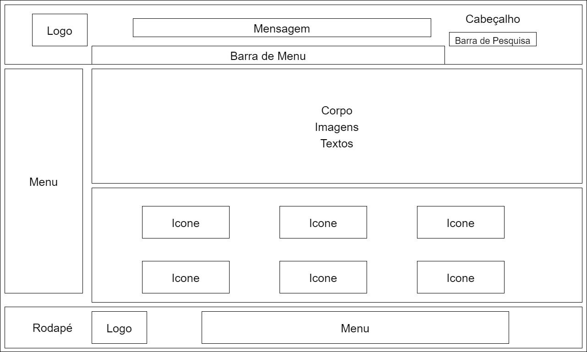

# Guia de Estilo

## 1 - Introdução

### 1.1 - Objetivo do guia de estilo  

&emsp;&emsp;O objetivo do guia de estilo é registrar as principais decisões de design tomadas, sendo que não se percam, ou seja, que sejam efetivamente incorporadas no produto final. Serve como uma ferramenta de dialogo entre os integrantes da equipe de design e também com a equipe de desenvolvimento. É importante que as decisões de design possam ser facilmente consultadas e reutilizadas nos debates sobre extensões ou versões futuras do produto.  

### 1.2 - Organização e conteúdo do guia de estilo  

&emsp;&emsp;A organização é baseado no ciclo de vida da Engenharia de usabilidade de Mayhew, em que os princípios do guia estão de acordo com as metas de usabilidade e que possam ser verificadas durante a utilização deste artefato.

### 1.3 - Público-alvo do guia de estilo  

&emsp;&emsp;No presente caso, o público-alvo são os alunos do grupo 5 (Grupo [Brasil Channel](https://www.brasilchannel.com.br/)) que vão trabalhar em referência à esse guia de estilo.  

### 1.4 - Como utilizar o guia  

&emsp;&emsp;Deve ser utilizado como ferramenta de guia para produção dos artefatos em relação ao design, interface e interações, como em verificação e análise após os artefatos produzidos. Também caso haja alguma forma de problema em que o guia de estilo não satisfaz, alterações e atualizações serão feitas no guia.

### 1.5 - Como manter o guia  

&emsp;&emsp;De acordo com a Engenharia de usabilidade de Mayhew, o guia é mantido, de forma iterativa, por verificação em ciclo.

## 2 - Resultados de análise  

### 2.1 - Descrição do ambiente de trabalho do usuário  

&emsp;&emsp;Na tela inicial, o usuário encontra a imagem da logo no canto superior direito, no cabeçalho vai encontrar uma mensagem "Uma Viagem pelo Brasil" e embaixo dessa mensagem um menu com com cinco caixas de seleção, que ao passar por cima delas, aciona uma lista de palavras selecionáveis para cada menu. No corpo da página vai estar uma mapa da localização do Brasil no globo e no continente sul-americano, um texto contando uma breve história do Brasil, como foi sua formação, suas capitais durante sua formação etc. E chegando próximo ao rodapé, uma lista de ícones acessáveis, que são as mesmas páginas contidas no menu "Brasil".  

## 3 - Elementos da interface

### 3.1 - Disposição espacial e grid  

&emsp;&emsp;A página deve utilizar um grid intuitivo, onde o usuário poderá ver com clareza as opçẽs de acesso e o conteúdo presente na página, com a logo estabelecida no canto superior esquerdo como inferior esquerdo, logo ao lado a mensagem do site "Uma viagem pelo Brasil", assim como a barra de menu e outros ponto apresentados na figura 3.1.1.

<small>
Figura 3.1.1 - Figura elaborada pelo autor do artefato
</small>  

### 3.2 - Janelas  

&emsp;&emsp;O principal meio de navegação do site é por meio de hiperlinks, tendo também ícones selecionáveis e barra de pesquisa. Sendo asssim, as páginas seguirão um padrão de cabeçalho, menu lateral e rodapé, alterando a disposição do conteúdo, layout e figuras no corpo da página.

### 3.3 - Tipografia

&emsp;&emsp;A fonte que deve ser utilizada é a [Open Sans](https://fonts.google.com/specimen/Open+Sans#standard-styles), em que as fontes podem variar entre bold, regular e italic, de tamanho diferentes. Segue a figura 3.3.1 apresentando a fonte.  

<small>
Figura 3.3.1 - Fonte: https://www.dafontfree.io/open-sans-font-family/
</small>  

### 3.4 Símbolos não tipográficos

&emsp;&emsp;Em algumas páginas, terão icones de acesso no corpo da página em que serão represenados como a figura 3.4.1 com uma identificação na parte inferior do ícone, serão selecionaveis e também serão colocados no rodapé.

<small>
Figura 3.4.1 - Fonte: https://www.canstockphoto.com.br/states-brasileiro-bandeiras-vetorial-86086034.html
</small>  

### 3.5 - Cores  

&emsp;&emsp;A figura 3.5.1 apresenta as cores que devem ser utilizadas no site, as cores podem ser adicionados ou retiradas conforme a necessidade da produção do site.  

<small>
Figura 3.5.1 - Figura elaborada pelo autor do artefato
</small>  

### 3.6 - Animações  

&emsp;&emsp;Algumas animações nos mapas inseridos em alguma páginas funcionam com o objetivo de guiar o usuário no momento de clicar no hiperlink, assim a parte que o mouse passar por cima vai mostrar um efeito de elevação.  

### 3.7 - Logo  

&emsp;&emsp; Foi debatido entre os integrantes do grupo uma forma de alterar a logo, em que a logo atual, que é demonstrada na figura 3.7.1, apresenta informações sofisticadas e difere da meta de usabilidade de simplicidade, sendo assim a figura 3.7.2 apresenta a logo sugerida pelos integrantes do grupo.  

<small>
Figura 3.7.1 - Fonte: https://www.brasilchannel.com.br/
</small> 

<small>
Figura 3.7.2 - Figura elaborada pelo grupo
</small> 

## 4 - Elementos de interação

### 4.1 - Estilo de interação

&emsp;&emsp;O estilo de iteração remete a forma como o usuário vai interagir com o site, dentro do Brasil Channel ele consegue interagir apenas por hiperlinks, onde cada tópico abre uma lista de opções por onde pode ser orientado com os titulos do link para onde pode ele leva.

### 4.2 - Seleção de um estilo 

&emsp;&emsp;Para o nosso protótipo vamos melhorar a seleção das opções, assim organizando melhor cada tópico para evitar a quantidade desnecessária de links em cada uma das opções, juntamente com novas imagens melhorando assim a visualização para o usuário. 

### 4.3 Aceleradores (teclas de atalho)  

&emsp;&emsp;Não se tem a necessidade de usar aceleradores no site.

## 5 - Elementos de ação  

### 5.1 - Preenchimentos de campos  

&emsp;&emsp;No cabeçalho da págine tem um campo de preenchimento no canto superior direito, em que ao selecioná-lo, ele apresenta um menu suspendo com sugestões ao inserir as letras.

### 5.2 - Seleção

&emsp;&emsp;No presente site não se tem necessidade de elementos de seleção, claro, podendo ser modificado a partir de uma verificação que aponte a necessidade de um elemento de seleção.

### 5.3 - Ativação  

&emsp;&emsp;No presente site não se tem necessidade de elementos de ativação, claro, podendo ser modificado a partir de uma verificação que aponte a necessidade de um elemento de ativação.

## 6 - Vocabulário e padrões  

### 6.1 - Terminologia  
  
&emsp;&emsp;Como o site é destinado para pessoas interessadas em obter o conhecimento sobre o Brasil, então a liguagem a ser utilizada é simples contento alguns termos técnico, por exemplo, os dados demográficos, população etc.

### 6.2 - Tipos de tela(para tarfefas comuns)
  
  &emsp;&emsp;Os tipos de tela que deve ser feitas são:  

  - Tela de início: Possui um título, a história do Brasil e um imagem
  - Tela de Regiões: Possui um mapa selecionavel da região e hiperlinks próximo ao rodapé
  - Tela de Estado: Possui um mapa selecionável do estado e hiperlinks próximo ao rodape
  - Tela de informações: após entrar nessas tela principais, as tela apresentadas sofrem pouca mudança durante seu cicl0 de vida;

### 6.3 - Sequências de diálogos (Feedback ou confirmação de uma operaao)

&emsp;&emsp;Como o site é destinado à pesquisas, então não se vê necessidade em montar uma sequência de dialogos.

## Histórico de Versão

| Versão |                Alteração               | Responsável |         Revisor        |  Data |
|:------:|:--------------------------------------:|:-----------:|:----------------------:|:-----:|
|   1.0  | Criação do documento e adição dos tópicos 1 e 2 |    Levi Queiroz   |  - | 01/08/2022 |
|   1.1  | Criação do documento e adição do tópico 4 |    Pedro Henrique   |  Levi Queiroz | 01/08/2022 |
|   1.2  | Adição do tópico 3 e figuras |    Levi Queiroz   |  - | 01/08/2022 |
|   1.3  | Adição do tópico 5, 6 e figuras |    Levi Queiroz   |  - | 02/08/2022 |

## Referências

- BARBOSA, Simone; DINIZ, Bruno. Interação Humano-Computador, Editora Elsevier, Rio de Janeiro, 2010.