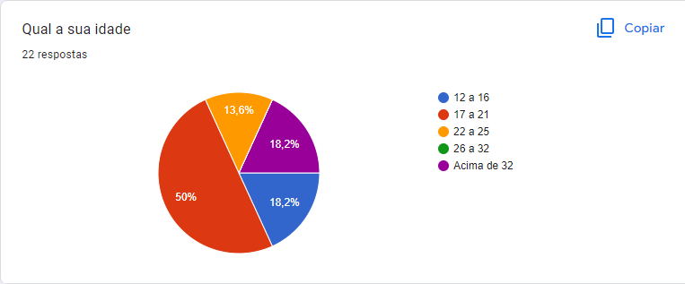
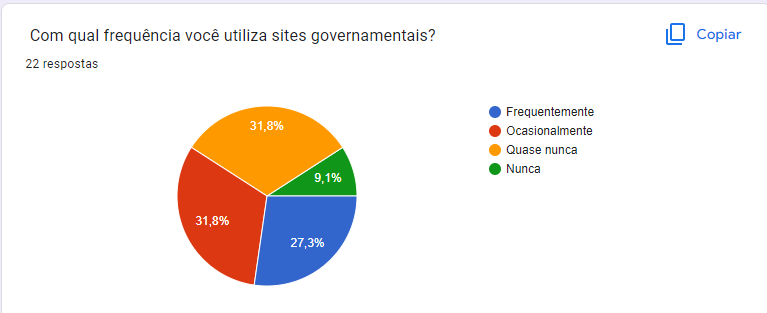
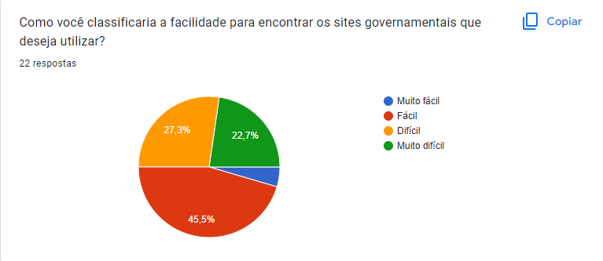
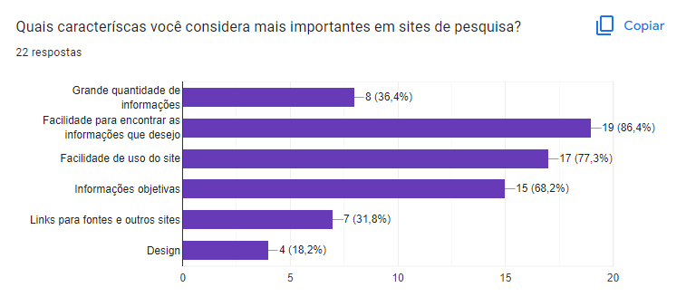

# Perfil de Usuário

## 1. Introdução
&emsp;&emsp;Com o objetivo de aumentar o conhecimento sobre os usuários do sistema, uma técnica muito utilizada é o registro do Perfil do Usuário. Sendo assim, este perfil nos ajuda compreender um pouco mais sobre as características destes usuários, respondendo perguntas como quem são, quais seus objetivos, e também, coletando dados demográficos deles. Desta forma, o perfil de usuário irá compor uma descrição detalhada das características dos usuários que irão utilizar o sistema.

## 2. Metodologia
&emsp;&emsp;Para a elaboração do Perfil de Usuário optamos pelo uso de questionários online, utilizando a plataforma do [Google Forms](../planejamento/ferramentas.md), para que dessa forma possamos coletar dados de um maior número de usuários. Dessa maneira, levando em conta que as características de um perfil de usuário devem ser priorizadas conforme o projeto em questão, decidimos coletar os seguintes dados a partir das respostas das seguintes perguntas:

- Qual a sua idade?
- Qual o seu grau de instrução?
- Com qual frequência você acessa sites na internet?
- Quando você deseja fazer uma pesquisa, qual ferramenta você utiliza?
- Com qual frequência você pesquisa informações geográficas, históricas e demográficas do Brasil?
- Com qual frequência você utiliza sites governamentais?
- Como você classificaria a facilidade para encontrar os sites governamentais que deseja utilizar?
- Quais caracteríscas você considera mais importantes em sites de pesquisa?
## 3. Execução da tarefa 
### 3.1 Motivação para a utilização do site
&emsp;&emsp;O site é utilizado como um centro de informações unificado, onde o usuário consegue encontrar uma grande quantidade de conteúdo sobre o Brasil em um só lugar. 
Dessa forma ele evita a atividade de executar várias pesquisas em seu navegador, encontrando todo tipo de informação apenas no site do Brasil channel com poucos clicks.

### 3.2  Tarefas a serem cumpridas 

&emsp;&emsp;Será feito um formulário sendo divulgado dentro dos canais não formais de comunicação da universidade (grupos whatsapp e telegram), para a apresentação dos dados coletados e estudo do tipo de usuário do site.

### 3.3 Passos para a execução da tarefa 

1- Escrever o formulário

2 - Compartilhar nos grupos de amigos e disciplinas

3 - Análise dos gráficos obtidos de cada pergunta 

4 - Utilização dos dados para o auxílio  das próximas tarefas e requisitos do projeto.  

## 4. Respostas 
### 4.1 Questão 1

<figcaption align='center'>
    <b>Figura 1: Primeira pergunta.</b>
</figcaption>

&emsp;&emsp;A partir das repostas podemos concluir que o houve um equilíbrio entre as idades dos participantes deste questionário. Desta formo, levando-nos a concluir que este site pode ser utilizado tanto para pessoas mais jovens, quanto mais velhas.

### 4.2 Questão 2

<figcaption align='center'>
    <b>Figura 2: Segunda pergunta.</b>
</figcaption>

&emsp;&emsp; Com a segunda pergunta concluimos que estudantes universitários cursando e já formados e estudantes do ensino fundamental são os principais grupos de usuários.

### 4.3 Questão 3

<figcaption align='center'>
    <b>Figura 3: Terceira pergunta.</b>
</figcaption>

&emsp;&emsp;Com estes resultados, podemos assumir que o usuário padrão é alguem que tem o acesso à internet e pelo menos algum nível de experiência com ela.

### 4.4 Questão 4

<figcaption align='center'>
    <b>Figura 4: Quarta pergunta.</b>
</figcaption>

&emsp;&emsp;Como esperado, os usuários consideram a internet como sua principal fonte de informações para pesquisas.
### 4.5 Questão 5

<figcaption align='center'>
    <b>Figura 5: Quinta pergunta.</b>
</figcaption>

&emsp;&emsp;Aqui podemos ver uma boa divisão entre os participantes, com a maioria respondendo que ocasionalmente pesquisam sobre dados do Brasil.

### 4.6 Questão 6

<figcaption align='center'>
    <b>Figura 6: Sexta pergunta.</b>
</figcaption>

&emsp;&emsp;Com a sexta pergunta percebemos que uma baixa porcentagem dos participantes nunca utilizou sites governamentais, mostrando assim que estes são um importante foco para o sistema.
### 4.7 Questão 7

<figcaption align='center'>
    <b>Figura 7: Sétima pergunta.</b>
</figcaption>

&emsp;&emsp;A partir destes dados, vemos que uma significativa parcela dos que responderam possuem algum tipo de dificuldade em encontrar sistes governamentais. Assim, destacando ainda mais a importância destes para o usuário.

### 4.8 Questão 8

<figcaption align='center'>
    <b>Figura 8: Oitava pergunta.</b>
</figcaption>

&emsp;&emsp; Por fim, com a questão 8 podemos perceber que para os usários, em um site de pesquisa as ferramentas funcionais e a facilidade utilização são as características mais importantes.

## 5. Resultados
&emsp;&emsp;A partir dos resultados do questionários teremos uma base de dados significativa para determinar os perfis de nossos usuários e especifíca-los por meio de [personas](./personas.md), para que assim possamos focar nos requisitos que atenderão suas necessidades.
## Histórico de versão

| Versão |                Alteração               | Responsável |         Revisor        |  Data |
|:------:|:--------------------------------------:|:-----------:|:----------------------:|:-----:|
|   1.0  | Criação do documento |    Lucas   |  | 16/07/2022 |
|   2.0  | Verificação do documento | Pedro | 21/08/2022 |

## Referências
- BARBOSA, Simone; SILVA, Bruno. Interação Humano Computador. Rio de Janeiro. Elsevier Editora Ltda. 2010