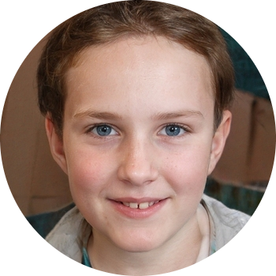
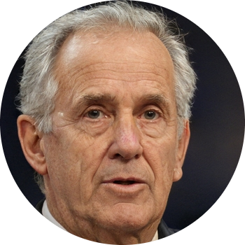

# Personas

## 1. Introdução
&emsp;&emsp;A técnica do uso de personas é utilizada para representar um grupo de usuários finais de um sistema. Esta técnica é muito utilizada durante discussões de design e elicitação de requisitos, para que o time se mantenha focado em um mesmo alvo em relação aos usuários. Dessa forma, fazendo com que a equipe não busque satisfazer a maior parte das pessoas, e sim seus grupos de usuários reais. 

&emsp;&emsp;Uma persona é um personagem fictício com características baseadas em grupos de usuários reais. As personas tem como objetivo descrever um usuário típico do sistema. Estes personagens, embora sejam fictícios, são derivados de processos de investigação e pesquisa que buscam levantar dados e caractrísticas sobre os usuários, no caso deste projeto tais investigações e seus resultados podem ser encontrados na secção de [Perfil de Usuário](./perfilUsuario.md). Aliado a isso, as personas são dividas em:

- Primárias: foco principal do sistema, representa o ussário que interage regularmente com o sistema.
- Secundárias: usuários que interagem ocasionalmente com o sistema.

&emsp;&emsp;Além disso, uma adição para esta técnica é a criação de antipersonas que, diferente das personas, buscam descrever e especificar grupos de usuários que o time não deve focar durante o desenvolvimento do sistema.

## 2. Metodologia
&emsp;&emsp;Para podermos especificar nossos grupos de usuários em forma de persona, primeiro tivemos que definir quantas personas seriam criadas. E após conversas entre o grupo baseadas nas aulas ministradas e nas referências bibliográficas utilizadas, foi decidido que seriam estabelecidas três personas primárias e uma antipersona.

&emsp;&emsp;Diante disso, a criação de nossas personas foram baseadas nos elementos característicos especificados por Courage e Baxter(2005), que são:

- Identidade: nome, sobrenome, idade e outros dados demográficos.
- Status: define se é persona primária, secundária, ou então, outro stakeholder ou antipersona.
- Objetivos: descreve objetivos das personas.
- Habilidades: especialidade, grau de escolaridade, grau de familiaridade com tecnologia. 
- Tarefas: descreve as tarefas realizadas pela persona no sistema.
- Relacionamento: com quem a persona se relaciona.
- Requsitos: de que a persona precisa.
- Expectativas: como a persona acredita que o sistema funciona.

## 3. Personas
### 3.1 Valenttina Almeida

<figcaption align='center'>
    <b>Figura 1: Pirmeira persona.</b>
     <small>Fonte: <a href='https://thispersondoesnotexist.com/'>Thispersondoesnotexist</a> </small>
</figcaption>

- Idade: 13 anos
- Escolaridade: Cursando ensino fundamental
- Profissão: Estudante
- Status: Primária
- Objetivos: Deseja pesquisar dados geográficos, demográficos, históricos e culturais sobre o Brasil 
- Expectativa: Busca entrar em apenas um site e econtrar facilmente todos as informações necessárias para sua pesquisa
- Habilidade: Sabe ler e tem familiaridade com computadores.

&emsp;Valenttina é uma criança de 13 anos, mora com seus pais na cidade de São Paulo e está cursando o oitavo ano do ensino fundamental. Suas atividades favoritas são sair com suas amigas e asssistir vídeos no TikTok. Frequentemente na escola os professores pedem trabalhos e deveres de casa baseados em pesquisas para Vallentina, por não gostar muito de livros ela prefere buscar as informações na internet, já que desde os 6 anos ela já sabe como mexer em computadores e celulares. 

### 3.2 Roberta Silva

<figcaption align='center'>
    <b>Figura 2: Segunda persona.</b>
     <small>Fonte: <a href='https://thispersondoesnotexist.com/'>Thispersondoesnotexist</a> </small>
</figcaption>

- Idade: 26 anos
- Escolaridade: Ensino Superior Completo
- Profissão: Musicista
- Status: Primária
- Objetivos: Deseja pesquisar informações sobre o clima e o turismo de diversas cidades de diferentes regiões do país
- Expectativa: Espera econtrar variadas informações e links para sites que possam ajudar ela com sua pesquisa. Também espera uma boa interface de pesquisa já que pretende passar bastante tempo no site.
- Habilidade: Gosta de ler e tem muita experência com viagens

&emsp;Roberta é uma musicista que concluiu sua graduação e decidiu que iria passar os próximos anos de sua vida viajando para explorar o Brasil. Para economizar dinheiro para as diversas viagens que realiza por ano, ela mora com seus pais e busca gastar o minímo possível com gastos desnecessários. Roberta ama ler e pesquisar sobre viagens na internet, e passa grande parte de seu tempo pesquisando informações sobre seus próximos destinos, desde asptectos climáticos e históricos da região até questões ligadas diretamente ao turismo.

### 3.3 Carlos Eduardo Lima

<figcaption align='center'>
    <b>Figura 3: Terceira persona.</b>
     <small>Fonte: <a href='https://thispersondoesnotexist.com/'>Thispersondoesnotexist</a> </small>
</figcaption>

- Idade: 70 anos
- Escolaridade: Doutor
- Profissão: Aposentado
- Status: Primária
- Objetivos: Deseja encontrar uma lista de todos sites governamentais de sua cidade
- Expectativa: Busca entrar em um site de fácil usablidade, de maneira rápida e simples e poder encontrar uma lista com links para todos os sites governamentais de sua cidade
- Habilidade: Conhecimento profundo em ciências socias e pouco familiarizado com a internet e tecnologias

&emsp;Carlos se formou em Ciências Sociais e passou toda sua vida estudando sobre o assunto, se tornou um doutor e passou a ministrar aulas em diferentes universidades do país. Carlos aposentou-se recentemente e agora passa a maior parte de seu tempo em casa e odeia sair para resolver problemas relacionados a documentos e outras questões ligadas ao governo, então pediu para que seus netos o ensinassem a entrar na internet para que ele pudesse resolver estes problemas de casa, porém ele ainda não se adaptou bem e tem dificuldade de fazer pesquisas.

## 4. Antipersonas

### 4.1 Ulisses Chagas

<figcaption align='center'>
    <b>Figura 4: Antipersona.</b>
     <small>Fonte: <a href='https://thispersondoesnotexist.com/'>Thispersondoesnotexist</a> </small>
</figcaption>

- Idade: 75 anos
- Escolaridade: Ensino Médio Completo
- Profissão: Aposentado
- Status: Primária
- Objetivos: Deseja fazer pesquisas em livros e enciclopédias
- Expectativa: Não busca entrar na internet para procurar informações
- Habilidade: Gosta de ler e fazer trabalhos manuais

Ulisses tem 75 anos, se aposentou 5 anos atrás após mais de 40 anos trabalhando como dono de um bar em sua cidade. Ulisses não tem computadores e detesta que seus netos fiquem mexendo no celular. Ele acredita que a internet não possui informações de qualidade, e por isso, quando deseja pesquisar algo prefere ir em busca de livros, enciclopédias ou então perguntar para alguém. 

## Histórico de versão

| Versão |                Alteração               | Responsável |         Revisor        |  Data |
|:------:|:--------------------------------------:|:-----------:|:----------------------:|:-----:|
|   1.0  | Criação do documento |    Lucas   |  | 16/07/2022 |

## Referências
- BARBOSA, Simone; SILVA, Bruno. Interação Humano Computador. Rio de Janeiro. Elsevier Editora Ltda. 2010
- COURAGE, Catherine; BAXTER, Kathy. Understanding Your Users: A pratical guide to user requirements methods, tools and techniques. 2005