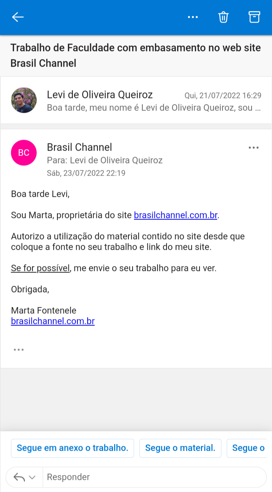

# Início

<small>
Imagem obtido do site https://www.brasilchannel.com.br/
</small>

## 1. Sobre o Site
&emsp;&emsp; O [Brasil channel](https://www.brasilchannel.com.br/) é um site voltado para informações gerais sobre o Brasil e suas regiões. Dentro do site podemos encontrar diversas informações como o clima, folclore, fauna e links diretos para sites governamentais. Dessa forma reunindo diversas informações sobre o país, seus estados e municípios em um só lugar. 

## 2. Sobre o Projeto

&emsp;&emsp;Este repositório está destinado à disciplina de Interação Humano-Computador da Universidade de Brasília. Seu objetivo é a analise do site Brasil channel, aplicando os conceitos estudados na disciplina para assim se obter uma melhor usabilidade do site. 

## 3. Autorização de CopyRight

&emsp;&emsp;O site [Brasil Channel](https://www.brasilchannel.com.br/) possui direitos autorais de proibição de reprodução parcial ou total do site, defendidos pelas leis Nº 9.610 - DIREITOS AUTORAIS, Nº 9.609 - PROTEÇÃO DA PROPRIEDADE INTELECTUAL e Nº 10.695 - CÓDIGO DE PROCESSO PENAL. A Srta. Marta Fontenele, proprietária do site, por meio de um e-mail na plataforma Outlook autorizou a utilização do site sendo o objetivo a aplicação dos conceitos aprendidos em sala no curso de IHC, colocando o link do site e as fontes neste presente trabalho. Segue a figura 3.1 apresentando o e-mail da autorização:  

</img>

<small>
Figura 3.1 - E-mail com a autorização para a utilização do site Brasil Channel obtido da plataforma Outlook
</small>

## 4. Equipe

|                                                           | Membro             | Github            |
| --------------------------------------------------------- | ------------------ | ----------------- |
|         | Kathlyn Lara Murussi      | [klmurussi](https://github.com/klmurussi)      |
|     | Levi de Oliveira Queiroz       | [LeviQ27](https://github.com/LeviQ27)        |
|  | Lucas Pimentel Quintão     | [LucasPimentel123](https://github.com/LucasPimentel123)  |
| | Pedro Henrique Caldeira de Moraes| [PedroMoraes39](https://github.com/PedroMoraes39)       |
|        | Samuel Victor Castro Macêdo | [SamuelCastro7](https://github.com/SamuelCastro7) |

## Histórico de versões

| Versão |                Alteração               | Autor(es) |         Revisor(es)        |  Data |
|:------:|:--------------------------------------:|:-----------:|:----------------------:|:-----:|
|   1.0  |                    -                   |    Pedro Henrique    | Lucas | 06/07/2022 |
|   2.0  |   Adiciona versionamento, fotos e corrige erros de código                 |  Lucas      | Kathlyn Lara | 10/07/2022 |
|   3.0  |   Adiciona fontes e autorização Copyright                 |  Levi Queiroz      | - | 31/07/2022 |
