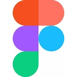
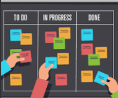
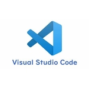
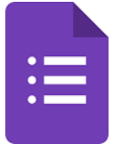

# Ferramentas

## 1. Introdução

&emsp;&emsp;Para que o projeto seja concluído, será necessário o uso das ferramentas presentes na tabela 1:

   

Tabela 1 - Ferramentas

| Logo | Ferramenta | Finalidade |
| :------: | :----------: | :---------------------------------------------------: |
|     | Canva     | Utilizado para a elaboração das apresentações |
|   | Discord   | Reuniões da equipe para a elaboração das atividades |
|     | Figma     | Utilizado para fazer o Rich Picture |
|    | Github    | Repositório do Projeto |
|     | Obs     | Utilizado para a gravação das apresentações do projeto |
|    | Kanban  | Ferramenta para aplicação da metodologia ágil |
|    | VsCode  | Editor de texto para o repositório |
|  | Telegram | Aplicativo de conversas, onde criamos um grupo para o projeto |
|  | Google forms | Aplicativo para questionários |
|  | Diagram IO  | Aplicativo para desenvolvimento de diagramas e desenhos |

Tabela 1: Ferramentas 

## Histórico de Versão

| Versão |                Alteração               | Responsável |         Revisor        |  Data |
|:------:|:--------------------------------------:|:-----------:|:----------------------:|:-----:|
|   1.0  |                    -                   |    Lucas   | Levi | 06/07/2022 |
|   1.1  | Arquivo Revisado |    Lucas   | Levi | 09/07/2022 |