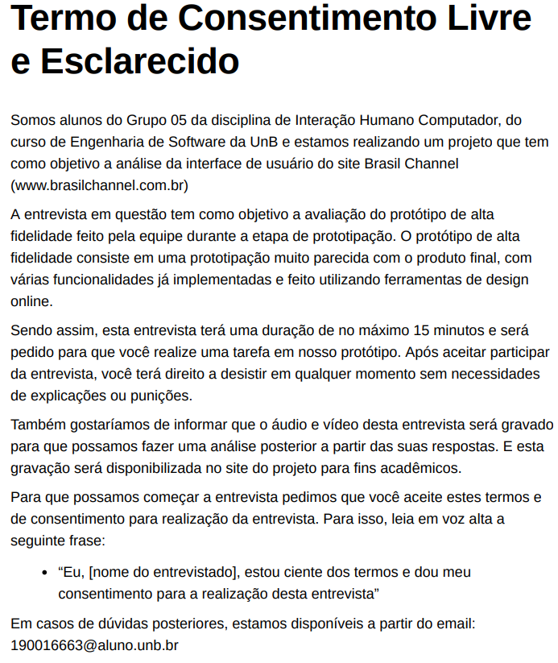

# Planejamento da Avaliação do Protótipo de Alta Fidelidade

## 1. Introdução
&emsp;&emsp; De acordo com Barbosa (2010), a avaliação é uma atividade fundamental para qualquer processo de desenvolvimento que busque um sistema interativo com alta qualidade de uso. Dessa forma, conhecer os critérios de qualidade e seguir com o desenvolvimento nem sempre é o suficiente para o desenvolvimento de um produto de qualidade, também é necessário avaliar se o produto atende os critérios de qualidade necessários, certificando-se que não ocorreram problemas na coleta e na interpretação das informações.

## 2. Metodologia
&emsp;&emsp; Para fazer a avaliação, optamos por usar o Framework DECIDE, proposto por Sharp, Rogers e Preece (2007) e citado por Simone Barbosa (2010), para que possamos planejar, executar e analisar esta avaliação.

&emsp;&emsp; Este Framework busca descrever atividades interligadas e executadas iterativamente, à medida que o avaliador articula os objetivos da avaliação, os dados e recursos disponíveis. Sendo assim, as atividades do Framework são:

- **D**: Determinar os objetivos da avaliação.
- **E**: Explorar perguntas a serem respondidas com a avaliação. 
- **C**: Escolher (Choose) os métodos de avaliação a serem utilizados.
- **I**: Identificar e administrar questões práticas da avaliação.
- **D**: Decidir como lidar com questões éticas.
- **E**: Avaliar (Evaluate), interpretar e apresentar os dados.

## 3. Objetivo da Avaliação
&emsp;&emsp; Para esta avaliação, temos como objetivo identificar se o fluxo de tarefas e a usabilidade do nosso protótipo de alta fidelidade está de acordo com as expectativas de nossos usuários.

## 4. Método para a Avaliação
&emsp;&emsp; Para realizar a avaliação utilizaremos uma das técnicas de avaliação através da observação, o teste de usabilidade. Como definido por Barbosa (2010), o teste de usabilidade busca avaliar a usabilidade de um sistema a partir das experiências de uso de seus usuários-alvo.

&emsp;&emsp; Para podermos realizar estes testes, agendaremos cinco entrevistas com usuários ou potenciais usuários do sistema, baseado em Nilsen (2000) que afirma que bastam 5 usuários para encontrarmos a maioria dos problemas na interface. Estes usuários ou potenciais usuários serão selecionados com base em nosso [Perfil de Usuário](../analiseRequisitos/perfilUsuario.md) e retratados por nossas [Personas](../analiseRequisitos/personas.md) definidos durante a etapa de Análise de Requisitos do projeto. Para a seleção destas pessoas iremos divulgar as entrevistas em grupos de whatsapp que o grupo julgar serem condizentes ao perfil de usuário. Além disso, faremos convites diretos à pessoas que saibamos que se encaixam nas características que buscamos.

## 5. Perguntas a serem respondidas com a Avaliação
&emsp;&emsp; Com base no objetivo da Avaliação do Protótipo de alta fidelidade, foram definidas perguntam a serem respondidas durante a avaliação baseadas na Tabela 9.1 do livro Interação Humano-Computador de Simone barbosa, e estas são:

- O usuário consegue operar o sistema?
- Ele atinge seu objetivo? Após cometer quantos erros?
- Que parte da interface e da interação o deixa insatisfeito?
- Ele entende o que significa e para que serve cada elemento de interface?
- Que problemas de IHC dificultam ou impedem o usuário de alcançar seus objetivos? 
- Onde esses problemas se manifestam? Com que frequência tendem a ocorrer? Qual é a gravidade desses problemas? 
- Quais barreiras o usuário encontra para atingir seus objetivos?

&emsp;&emsp; Sendo assim, para que possamos garantir que todas estas perguntas serão respondidas, iremos nos reunir virtualmente com os usuários, enviar para eles o link para o acesso do protótipo e pedir para que eles compartilhem a tela enquanto realizam a tarefa no sistema que for solicitada. Dessa maneira, iremos gravar a reunião, para que possamos ter em registro todos os cliques do usuário, assim marcando seus erros e acertos. Além disso, iremos incentivá-los a "pensar alto" equanto usam o sistema, para também registrarmos todas suas dúvidas e frustrações. E também, ao final iremos perguntar sobre sugestões de melhoria ou reclamações que eles possam ter.

## 6. Questões Éticas
&emsp;&emsp; Para que possamos garantir que os participantes das entrevistas estejam cientes de como as informações fornecidas por eles serão utilizadas e com o objetivo de contemplar os [Aspectos Éticos](../analiseRequisitos/aspectosEticos.md) definidos para o nosso trabalho, criamos um Termo de Consentimento que será enviado ao participante e, no início da entrevista, iremos solicitar que o participante leia-o, declarando que concorda com as informações apresentadas por ele. O termo de consentimento pode ser encontrado na imagem a baixo ou então a partir deste [link](../assets/prototipoAlta/Termo_de_Consentimento_Livre_e_Esclarecido_Prototipo_Alta.pdf).

<figcaption align='center'>
    <b>Figura 1: Termo de Consentimento.</b>
     <small>Fonte: Elaboração própria.</small>
</figcaption>

## 7. Cronograma Entrevistas
&emsp;&emsp; Para a melhor organização das entrevistas, a medida que as entrevistas com os usuários forem marcadas, serão adicionadas a este cronograma:

| Entrevistado |                Entrevistador               | Data |         Hora        |  
|:------:|:--------------------------------------:|:-----------:|:----------------------:|
|   Teste Piloto  |  Lucas, Samuel  |  7/09    | 10:00 | 
|   -  |  -  |    -   | - | 
|   -  |  -   |    - | - | 
|   -|   -   |    - | - | 
|   -  |  -  |    -    | - | 
|   -  |  -  |    -    | - | 

<figcaption align='center'>
    <b>Tabela 1: Cronograma de entrevistas.</b>
     <small>Fonte: Elaboração própria.</small>
</figcaption>

## Histórico de versões

| Versão |                Alteração               | Autor(es) |         Revisor(es)        |  Data |
|:------:|:--------------------------------------:|:-----------:|:----------------------:|:-----:|
|   1.0  |  Criação do documento  |    Lucas    | Lara | 05/09/2022 |
|   1.1  |  Arquivo revisado  |    Levi    | - | 05/09/2022 |

## Referências

- BARBOSA, Simone; DINIZ, Bruno. Interação Humano-Computador, Editora Elsevier, Rio de Janeiro, 2010.
