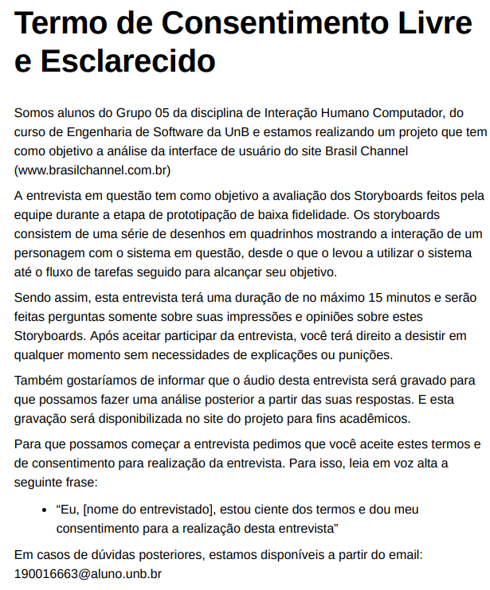

# Planejamento da Avaliação do Storyboard

## 1. Introdução
&emsp;&emsp; De acordo com Barbosa (2010), a avaliação é uma atividade fundamental para qualquer processo de desenvolvimento que busque um sistema interativo com alta qualidade de uso. Dessa forma, conhecer os critérios de qualidade e seguir com o desenvolvimento nem sempre é o suficiente para o desenvolvimento de um produto de qualidade, também é necessário avaliar se o produto atende os critérios de qualidade necessários, cecrtificando-se que não ocorreram problemas na coleta e na interpretação das informações.

## 2. Objetivo da Avaliação
&emsp;&emsp; Para esta avaliação, temos como objetivo identificar se os fluxos de tarefas representados pelos storyboards condizem com fluxos de usuários do sistema. E também, buscamos sugestões de onde e como podemos melhorar neste aspecto.

## 3. Metodologia
&emsp;&emsp; Para fazer a avaliação, optamos por usar o Framework DECIDE, proposto por Sharp, Rogers e Preece (2007), para que possamos planejar, executar e analisar esta avaliação.

&emsp;&emsp; Este Framework busca descrever atividades interligadas e executadas iterativamente, à medida que o avaliador articula os objetivos da avaliação, os dados e recursos disponíveis. Sendo assim, as atividades do Framework são:

- **D**: Determinar os objetivos da avaliação.
- **E**: Explorar perguntas a serem respondidas com a avaliação. 
- **C**: Escolher (Choose) os métodos de avaliação a serem utilizados.
- **I**: Identificar e administrar questões práticas da avaliação.
- **D**: Decidir como lidar com questões éticas.
- **E**: Avaliar (Evaluate), interpretar e apresentar os dados.

## 4. Método para a Avaliação
&emsp;&emsp; Para a realização da Avaliação dos Storyboards, optamos por utilizar um método de investigação, para que possamos ter acessso, interpretar e analisar opiniões e expectativas do usuário. Dessa forma, dentre os métodos de investigação, escolhemos a realização de entrevistas com usuários ou potenciais usuários do sistema.

&emsp;&emsp; No quesito da identificação e administração das questões práticas da avaliação, o grupo irá focar em encontrar usuários ou potênciais usuários do sistema baseando-se no [Perfil de Usuário](../analiseRequisitos/perfilUsuario.md) definido durante a etapa de Análise de Requisitos do projeto. E para isso, iremos divulgar a entrevista em grupos de aplicativos de mensagens que julguemos serem condizentes e depois iremos filtrar os interessados com base no Perfil de Usuário. Além disso, faremos convites diretos à pessoas que saibamos que se encaixam nas características que buscamos. Porém, no caso de grandes dificuldades em econtrar estes usuários, iremos conduzir estas entrevistas com as [Personas](../analiseRequisitos/personas.md), também definidas na Análise de Requisitos, através da técnica de Role Playing.

## 5. Perguntas a serem respondidas com a Avaliação
&emsp;&emsp; Com base no objetivo da Avaliação dos StoryBoards, foram definidas perguntam a serem respondidas durante a avaliação, e estas são:

- Os fluxos dos StoryBoards condizem com fluxos reais de usuários?
- As situações ilustradas pelos StoryBoards retratam possíveis situações reais do uso do sistema?
- Os personagens ilustrados nos storyboards condizem com usuários reais do sistema?
- O objetivo final alcançado pelos personagens dos storyboards condizem com objetivos de usuários que acessam o sistema?

&emsp;&emsp; Sendo assim, para que possamos garantir que todas estas perguntas serão respondidas, elaboramos um roteiro de perguntas para ser seguido pelos participantes durante as entrevistas, como podemos ver a partir da tabela abaixo: 

| Número | Pergunta |  Resposta Esperada |
|:--:|:--:|:---|
| 1 | Observando os StoryBoards você consegue se identificar com algum dos personagens? | <ul> <li> SIM</li> <li>  NÃO </li> </ul> |
| 1.1 | Você poderia explicar o motivo da sua resposta? | Pergunta discursiva |
| 2 | Observando os StoryBoards você acredita que as tarefas que os personagens executam no sistema condizem com tarefas que você executa no sistema?  | <ul> <li> SIM</li> <li>  NÃO </li></ul> |
| 2.1 | Você poderia explicar o motivo da sua resposta? | Pergunta discursiva |
| 3 | Com base nas situações que motivaram os usuário a usar o sistema, você acredita que elas representam sistuações reais em que você se sentiria motivado(a) a usar o sistema? | <ul> <li> SIM</li> <li>  NÃO </li></ul> |
| 3.1 | Você poderia explicar o motivo da sua resposta? | Pergunta discursiva |
| 4 | A partir do objetivo final alcançado pelos personagens dos StoryBoards com o uso do site, você identifica-os como sendo objetivos que você busca alcançar ao acessar o site? | <ul> <li> SIM</li> <li>  NÃO </li></ul> |
| 4.1 | Você poderia explicar o motivo da sua resposta? | Pergunta discursiva |
| 5 | Você tem alguma sugestão de melhoria ou correção nos nossos StoryBoards? | Pergunta discursiva |

<figcaption align='center'>
    <b>Tabela 1: Roteiro de Perguntas.</b>
     <small>Fonte: Elaboração própria.</small>
</figcaption>
## 6. Questões Éticas
&emsp;&emsp; Para que possamos garantir que os participantes das entrevistas estejam cientes de como as informações fornecidas por eles serão utilizadas e com o objetivo de contemplar os [Aspectos Éticos](../analiseRequisitos/aspectosEticos.md) definidos para o nosso trabalho, criamos um Termo de Consentimento que será enviado ao participante e, no início da entrevista, iremos solicitar que o participante leia-o, declarando que concorda com as informações apresentadas por ele. O termo de consentimento pode ser encontrado na imagem a baixo ou então a partir deste [link](../assets/storyboards/TCLE_StoryBoards.pdf).

<figcaption align='center'>
    <b>Figura 1: Termo de Consentimento.</b>
     <small>Fonte: Elaboração própria.</small>
</figcaption>

## Histórico de versões

| Versão |                Alteração               | Autor(es) |         Revisor(es)        |  Data |
|:------:|:--------------------------------------:|:-----------:|:----------------------:|:-----:|
|   1.0  |  Criação do documento  |    Lucas    | - | 07/08/2022 |

## Referências

- BARBOSA, Simone; DINIZ, Bruno. Interação Humano-Computador, Editora Elsevier, Rio de Janeiro, 2010.

