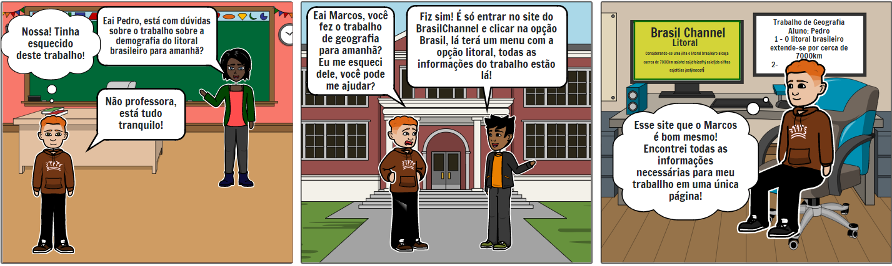

# Storyboard

## 1 - Introdução
  
&emsp;&emsp;Storyboard é uma prototipação de baixa-fidelidade, geralemnte utilizado em conjunto com cenários. Um storyboard abarcaema séria de desenhos mostrando como um usuário pode avançar em uma tarefa utilizando o produto que está sendo desenvolvido. Pode-se tratar de umasérie de telas esboçadas, no caso de um sistema e software baseado em Interfaces Gráficas com o Usuário (GUI), ou de uma série de cenas desenhadas mostrando como um usuário pode desempenhar determinada tarefa usando o produto.

## 2 - Objetivo
  
&emsp;&emsp;Para o nível 1 da fase de Design, avaliação e desenvolvimento do ciclo de vida de Mayhew (1999), o objetivo da utilização de protótipos de baixa-fidelidade é criar modelos conceituais que serão utilizados como insumo para realizar avaliações e validações do produto.

## 3 - Metodologia
  
&emsp;&emsp;Os storyboards foram produzidos com base nos documentos de análise de tarefas e personas. Montando assim os possíveis cenários, ambientes e os atores da história, em volta da realização das tarefas propóstas.

Para produzir os storyboards, a ferramente [StoryboardThat](https://www.storyboardthat.com/pt) foi utilizada.

## 4 - Storyboards
  
&emsp;&emsp;Para cada tarefa tem dois storyboards, o primeiro apresentando a realização da tarefa no site atual e o segundo apresentando a realização da tarefa no site com a atualização proposta pelo guia de estilo.

### 4.1 - Tarefa: Acessar Datas Comemorativas
  
&emsp;&emsp;A tarefa em questão foi realizada na análise de tarefa utilizando a ferramenta KLM-GOMS, assim o processo da realização da tarefa é:  

1. Acessar o hiperlink "Brasil - redescobrindo o gigante"
2. Visualizar o menu lateral
3. Acessar o hiperlink "Datas Comemorativas"
  
&emsp;&emsp;Assim, a figura 4.1.1 apresenta o storyboard da tarefa no site atual:

<small>
Figura 4.1.1 - Figura ilustrando a realização da tarefa no site atual. Fonte: Elaboração da equipe
</small>
  
### 4.2 - Tarefa: Encontrar o site do Ministério da Educação
  
&emsp;&emsp;A tarefa em questão foi realizada na análise de tarefas utilizando a ferramenta CMN-GOMS, sendo assim o processo de realização da tarefa é:
  

1. Acessar o hiperlink "Brasil - redescobrindo o gigante"
2. Visualizar o menu lateral
3. Acessar o hiperlink "Sites Governamentais"
4. Visualizar os hiperlinks até o hiperlink da próxima página
5. Acessar o hiperlink da próxima página
6. Acessar o hiperlink do "Ministério da Educação"
  
&emsp;&emsp;Assim, a figura 4.2.1 apresenta o storyboard da tarefa no site atual:
  

<small>
Figura 4.2.1 - Figura ilustrando a realização da tarefa no site atual. Fonte: Elaboração da equipe
</small>
  
### 4.3 - Tarefa: Acessar Litoral
  
&emsp;&emsp;A tarefa em questão foi realizada na análise de tarefas utilizando a ferramenta CTT, sendo assim o processo de realização de tarefa é:
  

1. Acessar o hiperlink "Brasil - redescobrindo o gigante"
2. Visualizar o menu lateral
3. Acessar o hiperlink "Litoral"
  
&emsp;&emsp;Assim, a figura 4.3.1 apresenta o storyboard da tarefa no site atual, onde um aluno do ensino fundamental precisa fazer um trabalho de geografia e deseja encontrar algum site onde tenha as informações para ele responder as perguntas necessárias:
  

<small>
Figura 4.3.1 - Figura ilustrando a realização da tarefa no site atual. Fonte: Elaboração da equipe
</small>
  
## 5 - Conclusão
  
&emsp;&emsp;Assim como falado no objetivo, espera-se que os integrantes que realizarão o design do produto possam entender se o produto atende ou não às necessidades dos usuários, entender situações, cenários em que as tarefas são realizadas e, consequentemente, realizar uma melhor avaliação das situaçôes e uma intervenção que ajuda e melhorar as interações no produto.
  
## Histórico de Versão

| Versão |                Alteração               | Responsável |         Revisor        |  Data |
|:------:|:--------------------------------------:|:-----------:|:----------------------:|:-----:|
|   1.0  | Criação do documento |    Levi Queiroz   |  Lucas | 08/08/2022 |
|   1.1  | Adição dos tópicos de 1 a 5 |    Levi Queiroz   |  Lucas | 08/08/2022 |
|   1.2  | Adição dos storyboard 3 |    Lucas   |  Samuel | 08/08/2022 |
|   1.2  | Adição dos storyboard 1 e 2 |    Levi Queiroz   |  - | 08/08/2022 |

## Referências

- BARBOSA, Simone; DINIZ, Bruno. Interação Humano-Computador, Editora Elsevier, Rio de Janeiro, 2010.