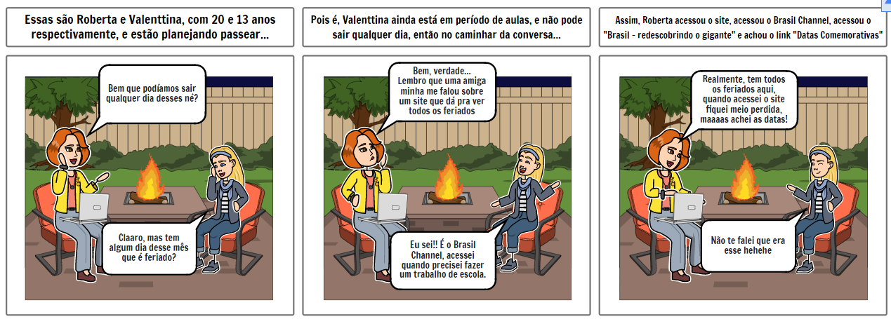
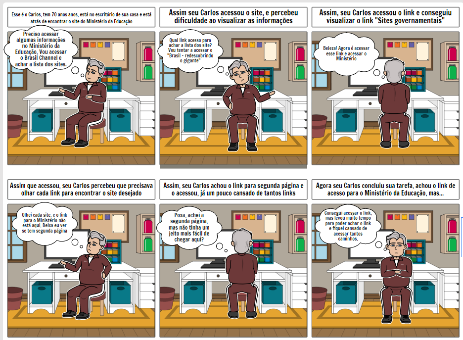
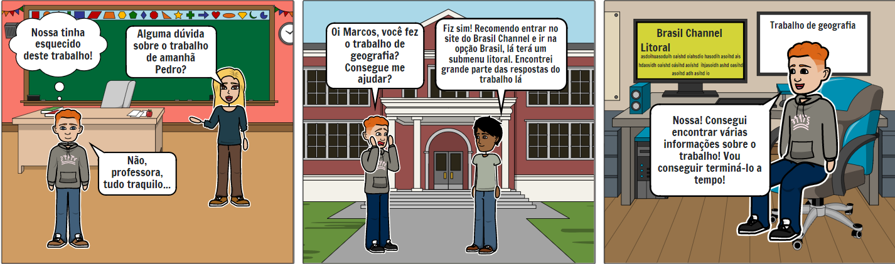

# Storyboard

## 1 - Introdução
  
&emsp;&emsp;Storyboard é uma prototipação de baixa-fidelidade, geralmente utilizado em conjunto com cenários. Um storyboard abarca uma séria de desenhos mostrando como um usuário pode avançar em uma tarefa utilizando o produto que está sendo desenvolvido. Pode-se tratar de uma série de telas esboçadas, no caso de um sistema e software baseado em Interfaces Gráficas com o Usuário (GUI), ou de uma série de cenas desenhadas mostrando como um usuário pode desempenhar determinada tarefa usando o produto.

## 2 - Objetivo
  
&emsp;&emsp;Para o nível 1 da fase de Design, avaliação e desenvolvimento do ciclo de vida de Mayhew (1999), o objetivo da utilização de protótipos de baixa-fidelidade é criar modelos conceituais que serão utilizados como insumo para realizar avaliações e validações do produto.

## 3 - Metodologia
  
&emsp;&emsp;Os storyboards foram produzidos com base nos documentos de análise de tarefas e personas. Montando assim os possíveis cenários, ambientes e os atores da história, em volta da realização das tarefas propóstas.

Para produzir os storyboards, a ferramente [StoryboardThat](https://www.storyboardthat.com/pt) foi utilizada.

## 4 - Storyboards
  
&emsp;&emsp;Para cada tarefa tem dois storyboards, o primeiro apresentando a realização da tarefa no site atual e o segundo apresentando a realização da tarefa no site com a atualização proposta pelo guia de estilo.

### 4.1 - Storyboard 1 (Tarefa: Acessar Datas Comemorativas)
  
&emsp;&emsp;A tarefa em questão foi realizada na análise de tarefa utilizando a ferramenta KLM-GOMS, assim o processo da realização da tarefa é:  

1. Acessar o hiperlink "Brasil - redescobrindo o gigante"
2. Visualizar o menu lateral
3. Acessar o hiperlink "Datas Comemorativas"
  
&emsp;&emsp;Assim, a figura 4.1.1 apresenta o storyboard da tarefa no site atual e a tabela 4.1.1 apresenta detalhadamente o storyboard:

<small>
Figura 4.1.1 - Figura ilustrando a realização da tarefa no site atual. Fonte: Elaboração da equipe
</small>

<table>
    <thead>
        <tr>
            <th style="text-align:center; border: 0.5px solid rgba(0,0,0,0.2);">Atividade</th>
            <th style="text-align:center; border: 0.5px solid rgba(0,0,0,0.2);">Tarefa</th>
            <th style="text-align:center; border: 0.5px solid rgba(0,0,0,0.2);">Definição</th>
        </tr>
    </thead>
    <tbody>
        <tr>
            <td style="vertical-align: middle;text-align:center;border: 0.5px solid rgba(0,0,0,0.2);" rowspan="3">Preparo</td>
            <td style="vertical-align: middle;text-align:center;border: 0.5px solid rgba(0,0,0,0.2);">Definição das pessoas envolvidas </td>
            <td style="vertical-align: middle;text-align:center;border: 0.5px solid rgba(0,0,0,0.2);">Roberta  Valenttina</td>
        </tr>
        <tr>
            <td style="vertical-align: middle;text-align:center;border: 0.5px solid rgba(0,0,0,0.2);">Definição do ambiente da história</td>
            <td style="vertical-align: middle;text-align:center;border: 0.5px solid rgba(0,0,0,0.2);"> Pesquisar sobre o próximo feriado </td>
        </tr>
        <tr>
            <td style="vertical-align: middle;text-align:center;border: 0.5px solid rgba(0,0,0,0.2);">Definição da tarefa que será abordada</td>
            <td style="vertical-align: middle;text-align:center;border: 0.5px solid rgba(0,0,0,0.2);">Indicar uma das informações encontradas no site do Brasil Channel</td>
        </tr>
        <tr>
            <td style="vertical-align: middle;text-align:center;border: 0.5px solid rgba(0,0,0,0.2);" rowspan="3">Sequência</td>
            <td style="vertical-align: middle;text-align:center;border: 0.5px solid rgba(0,0,0,0.2);">Definiçaõ de quais passos estão envolvidos para a realização da tarefa</td>
            <td style="vertical-align: middle;text-align:center;border: 0.5px solid rgba(0,0,0,0.2);">Acessar o hiperlink "Brasil - redescobrindo o gigante"   Visualizar o menu lateral    Acessar o hiperlink "Datas Comemorativas" </td>
        </tr>
        <tr>
            <td style="vertical-align: middle;text-align:center;border: 0.5px solid rgba(0,0,0,0.2);">Definição do que leva a pessoa a usar a aplicação</td>
            <td style="vertical-align: middle;text-align:center;border: 0.5px solid rgba(0,0,0,0.2);">Visualisar as datas comemorativas do mês </td>
        </tr>
            <td style="vertical-align: middle;text-align:center;border: 0.5px solid rgba(0,0,0,0.2);">Definição de qual (e como) a tarefa será ilustrada</td>
            <td style="vertical-align: middle;text-align:center;border: 0.5px solid rgba(0,0,0,0.2);">Será ilustrado por Roberta e Valenttina que estão em dúvida em saber quando será o próximo feriado, onde Valenttina sugere usarem o Brasil Channel para olharem quando vão poder fazer sua viagem </td>
        </tr>
        <tr>
            <td style="vertical-align: middle;text-align:center;border: 0.5px solid rgba(0,0,0,0.2);" rowspan="3">Satisfação</td>
            <td style="vertical-align: middle;text-align:center;border: 0.5px solid rgba(0,0,0,0.2);">Definição da motivação principal da pessoa que usa a aplicação</td> 
            <td style="vertical-align: middle;text-align:center;border: 0.5px solid rgba(0,0,0,0.2);">Conseguir se informar dos feriados do mês</td>
        </tr>
            <td style="vertical-align: middle;text-align:center;border: 0.5px solid rgba(0,0,0,0.2);">Definição das realizações que a aplicação permite</td>
            <td style="vertical-align: middle;text-align:center;border: 0.5px solid rgba(0,0,0,0.2);">Permite qualquer quer pessoa se informe sobre as datas comemorativas do mês </td>
        </tr>
        </tr>
            <td style="vertical-align: middle;text-align:center;border: 0.5px solid rgba(0,0,0,0.2);">Definição das necessidades que a aplicação se propõe a sanar </td>
            <td style="vertical-align: middle;text-align:center;border: 0.5px solid rgba(0,0,0,0.2);">Necessidade de informações sobre os feriados mais próximos </td>
        </tr>
    </tbody>
</table>
  </table>
<small>
 Tabela 4.1.1 - Tabela trazendo o detalhamento do storyboard da tarefa de acessar Datas Comemorativas  Fonte: Elaboração da equipe
</small>

### 4.2 - Storyboard 2 (Tarefa: Encontrar o site do Ministério da Educação)
  
&emsp;&emsp;A tarefa em questão foi realizada na análise de tarefas utilizando a ferramenta CMN-GOMS, sendo assim o processo de realização da tarefa é:
  

1. Acessar o hiperlink "Brasil - redescobrindo o gigante"
2. Visualizar o menu lateral
3. Acessar o hiperlink "Sites Governamentais"
4. Visualizar os hiperlinks até o hiperlink da próxima página
5. Acessar o hiperlink da próxima página
6. Acessar o hiperlink do "Ministério da Educação"
  
&emsp;&emsp;Assim, a figura 4.2.1 apresenta o storyboard da tarefa no site atual a tabela 4.2.1 apresenta detalhadamente o storyboard:
  

<small>
Figura 4.2.1 - Figura ilustrando a realização da tarefa no site atual. Fonte: Elaboração da equipe
</small>

<table>
    <thead>
        <tr>
            <th style="text-align:center; border: 0.5px solid rgba(0,0,0,0.2);">Atividade</th>
            <th style="text-align:center; border: 0.5px solid rgba(0,0,0,0.2);">Tarefa</th>
            <th style="text-align:center; border: 0.5px solid rgba(0,0,0,0.2);">Definição</th>
        </tr>
    </thead>
    <tbody>
        <tr>
            <td style="vertical-align: middle;text-align:center;border: 0.5px solid rgba(0,0,0,0.2);" rowspan="3">Preparo</td>
            <td style="vertical-align: middle;text-align:center;border: 0.5px solid rgba(0,0,0,0.2);">Definição das pessoas envolvidas </td>
            <td style="vertical-align: middle;text-align:center;border: 0.5px solid rgba(0,0,0,0.2);">Carlos</td>
        </tr>
        <tr>
            <td style="vertical-align: middle;text-align:center;border: 0.5px solid rgba(0,0,0,0.2);">Definição do ambiente da história</td>
            <td style="vertical-align: middle;text-align:center;border: 0.5px solid rgba(0,0,0,0.2);">Escritório de Carlos</td>
        </tr>
        <tr>
            <td style="vertical-align: middle;text-align:center;border: 0.5px solid rgba(0,0,0,0.2);">Definição da tarefa que será abordada</td>
            <td style="vertical-align: middle;text-align:center;border: 0.5px solid rgba(0,0,0,0.2);">Indicar o onde encontrar o link  para o site do Ministério da Educação </td>
        </tr>
        <tr>
            <td style="vertical-align: middle;text-align:center;border: 0.5px solid rgba(0,0,0,0.2);" rowspan="3">Sequência</td>
            <td style="vertical-align: middle;text-align:center;border: 0.5px solid rgba(0,0,0,0.2);">Definiçaõ de quais passos estão envolvidos para a realização da tarefa</td>
            <td style="vertical-align: middle;text-align:center;border: 0.5px solid rgba(0,0,0,0.2);">Acessar o hiperlink "Brasil - redescobrindo o gigante"   Visualizar o menu lateral   Acessar o hiperlink "Sites Governamentais"   Visualizar os hiperlinks até o hiperlink da próxima página   Acessar o hiperlink da próxima página   Acessar o hiperlink do "Ministério da Educação" </td>
        </tr>
        <tr>
            <td style="vertical-align: middle;text-align:center;border: 0.5px solid rgba(0,0,0,0.2);">Definição do que leva a pessoa a usar a aplicação</td>
            <td style="vertical-align: middle;text-align:center;border: 0.5px solid rgba(0,0,0,0.2);">Duvida sobre os sites estaduais do Brasil </td>
        </tr>
            <td style="vertical-align: middle;text-align:center;border: 0.5px solid rgba(0,0,0,0.2);">Definição de qual (e como) a tarefa será ilustrada</td>
            <td style="vertical-align: middle;text-align:center;border: 0.5px solid rgba(0,0,0,0.2);">A indicação de como acessar a área dos sites estaduais será ilustrada por um senhor chamado Carlos, que esta em duvida de como chegar ao site do Ministério da Educação, mostrando a dificuldade e confusão de navegar pelo site </td>
        </tr>
        <tr>
            <td style="vertical-align: middle;text-align:center;border: 0.5px solid rgba(0,0,0,0.2);" rowspan="3">Satisfação</td>
            <td style="vertical-align: middle;text-align:center;border: 0.5px solid rgba(0,0,0,0.2);">Definição da motivação principal da pessoa que usa a aplicação</td> 
            <td style="vertical-align: middle;text-align:center;border: 0.5px solid rgba(0,0,0,0.2);">Conseguir entender como navegar pelo site do Brasil Channel</td>
        </tr>
            <td style="vertical-align: middle;text-align:center;border: 0.5px solid rgba(0,0,0,0.2);">Definição das realizações que a aplicação permite</td>
            <td style="vertical-align: middle;text-align:center;border: 0.5px solid rgba(0,0,0,0.2);">Demonstrar uma das informações que podem ser acessadas no site</td>
        </tr>
        </tr>
            <td style="vertical-align: middle;text-align:center;border: 0.5px solid rgba(0,0,0,0.2);">Definição das necessidades que a aplicação se propõe a sanar </td>
            <td style="vertical-align: middle;text-align:center;border: 0.5px solid rgba(0,0,0,0.2);">Necessidade de informações sobre sites estatais oficiais do Brasil</td>
        </tr>
    </tbody>
</table>
  </table>
<small>
 Tabela 4.2.1 - Tabela trazendo o detalhamento do storyboard da tarefa de encontrar o link do Ministério da Educação  Fonte: Elaboração da equipe
</small>

### 4.3 - Storyboard 3 (Tarefa: Acessar Litoral) 
  
&emsp;&emsp;A tarefa em questão foi realizada na análise de tarefas utilizando a ferramenta CTT, sendo assim o processo de realização de tarefa é:
  

1. Acessar o hiperlink "Brasil - redescobrindo o gigante"
2. Visualizar o menu lateral
3. Acessar o hiperlink "Litoral"
  
&emsp;&emsp;Assim, a figura 4.3.1 apresenta o storyboard da tarefa no site atual,  onde um aluno do ensino fundamental precisa fazer um trabalho de geografia e deseja encontrar algum site onde tenha as informações para ele responder as perguntas necessárias, detalhado também na tabela 4.3.1:
  

<small>
Figura 4.3.1 - Figura ilustrando a realização da tarefa no site atual. Fonte: Elaboração da equipe
</small>
  <table>
    <thead>
        <tr>
            <th style="text-align:center; border: 0.5px solid rgba(0,0,0,0.2);">Atividade</th>
            <th style="text-align:center; border: 0.5px solid rgba(0,0,0,0.2);">Tarefa</th>
            <th style="text-align:center; border: 0.5px solid rgba(0,0,0,0.2);">Definição</th>
        </tr>
    </thead>
    <tbody>
        <tr>
            <td style="vertical-align: middle;text-align:center;border: 0.5px solid rgba(0,0,0,0.2);" rowspan="3">Preparo</td>
            <td style="vertical-align: middle;text-align:center;border: 0.5px solid rgba(0,0,0,0.2);">Definição das pessoas envolvidas </td>
            <td style="vertical-align: middle;text-align:center;border: 0.5px solid rgba(0,0,0,0.2);">Estudante Pedro   Estudante Marcos   Professora
        </tr>
        <tr>
            <td style="vertical-align: middle;text-align:center;border: 0.5px solid rgba(0,0,0,0.2);">Definição do ambiente da história</td>
            <td style="vertical-align: middle;text-align:center;border: 0.5px solid rgba(0,0,0,0.2);"> Trabalho passado na sala de aula para ser realizado em casa </td>
        </tr>
        <tr>
            <td style="vertical-align: middle;text-align:center;border: 0.5px solid rgba(0,0,0,0.2);">Definição da tarefa que será abordada</td>
            <td style="vertical-align: middle;text-align:center;border: 0.5px solid rgba(0,0,0,0.2);">Fatos geográficos do Brasil</td>
        </tr>
        <tr>
            <td style="vertical-align: middle;text-align:center;border: 0.5px solid rgba(0,0,0,0.2);" rowspan="3">Sequência</td>
            <td style="vertical-align: middle;text-align:center;border: 0.5px solid rgba(0,0,0,0.2);">Definiçaõ de quais passos estão envolvidos para a realização da tarefa</td>
            <td style="vertical-align: middle;text-align:center;border: 0.5px solid rgba(0,0,0,0.2);">Acessar o hiperlink "Brasil - redescobrindo o gigante"   Visualizar o menu lateral    Acessar o hiperlink "Litoral" </td>
        <tr>
            <td style="vertical-align: middle;text-align:center;border: 0.5px solid rgba(0,0,0,0.2);">Definição do que leva a pessoa a usar a aplicação</td>
            <td style="vertical-align: middle;text-align:center;border: 0.5px solid rgba(0,0,0,0.2);">Precisar buscar informações sobre o Brasil</td>
        </tr>
            <td style="vertical-align: middle;text-align:center;border: 0.5px solid rgba(0,0,0,0.2);">Definição de qual (e como) a tarefa será ilustrada</td>
            <td style="vertical-align: middle;text-align:center;border: 0.5px solid rgba(0,0,0,0.2);">A indicação de como navegar pelo site Brasil Channel será ilustrada com dois colegas que precisam fazer um trabalho de geografia passado pela professora, ao se encontrarem na frente do seu colégio, sendo que um deles já concluiu seu trabalho informa pro outro onde e como conseguir as informações para também conseguir termina-lo</td>
        </tr>
        <tr>
            <td style="vertical-align: middle;text-align:center;border: 0.5px solid rgba(0,0,0,0.2);" rowspan="3">Satisfação</td>
            <td style="vertical-align: middle;text-align:center;border: 0.5px solid rgba(0,0,0,0.2);">Definição da motivação principal da pessoa que usa a aplicação</td> 
            <td style="vertical-align: middle;text-align:center;border: 0.5px solid rgba(0,0,0,0.2);">Conseguir obter informações demográficas do Brasil</td>
        </tr>
            <td style="vertical-align: middle;text-align:center;border: 0.5px solid rgba(0,0,0,0.2);">Definição das realizações que a aplicação permite</td>
            <td style="vertical-align: middle;text-align:center;border: 0.5px solid rgba(0,0,0,0.2);">Permite que qualquer pessoa se informe mais sobre as informações demográficas do Brasil</td>
        </tr>
        </tr>
            <td style="vertical-align: middle;text-align:center;border: 0.5px solid rgba(0,0,0,0.2);">Definição das necessidades que a aplicação se propõe a sanar </td>
            <td style="vertical-align: middle;text-align:center;border: 0.5px solid rgba(0,0,0,0.2);">Deixar as pessoas detalhadamente informadas sobre o Brasil</td>
        </tr>
    </tbody>
</table>
<small>
 Tabela 4.3.1 - Tabela trazendo o detalhamento do storyboard da tarefa acessar Litoral  Fonte: Elaboração da equipe
</small>

## 5 - Conclusão
  
&emsp;&emsp;Assim como falado no objetivo, espera-se que os integrantes que realizarão o design do produto possam entender se o produto atende ou não às necessidades dos usuários, entender situações, cenários em que as tarefas são realizadas e, consequentemente, realizar uma melhor avaliação das situaçôes e uma intervenção que ajuda e melhorar as interações no produto.
  
## Histórico de Versão

| Versão |                Alteração               | Responsável |         Revisor        |  Data |
|:------:|:--------------------------------------:|:-----------:|:----------------------:|:-----:|
|   1.0  | Criação do documento |    Levi Queiroz   |  Lucas | 08/08/2022 |
|   1.1  | Adição dos tópicos de 1 a 5 |    Levi Queiroz   |  Lucas | 08/08/2022 |
|   1.2  | Adição dos storyboard 3 |    Lucas   |  Samuel | 08/08/2022 |
|   1.3  | Adição dos storyboard 1 e 2 |    Levi Queiroz   |  Samuel | 08/08/2022 |
|   1.4  | Adição das tabelas de detalhamento dos storyboard 1 e 2 e 3 |    Samuel e Pedro   |  Lucas | 08/08/2022 |
|   1.5  | Consertando erros ortográficos |    Levi Queiroz   |  Lucas | 09/08/2022 |
|   1.6  | Adiciona storyboard 3 versão 2 |    Lucas   |  - | 17/08/2022 |

## Referências

- BARBOSA, Simone; DINIZ, Bruno. Interação Humano-Computador, Editora Elsevier, Rio de Janeiro, 2010.