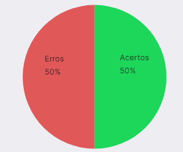
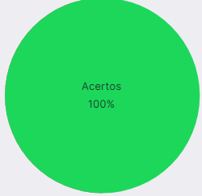

# Verificação Protótipo de papel

## 1. Introdução

&emsp;&emsp;Para verificar o [Protótipo de papel](../analiseRequisitos/perfilUsuario.md) do nosso projeto, usaremos a estratégia de "inspeções", seguindo o planejamento detalhado na página de [Planejamento da Verificação](../verificacao/planejamento.md)

## 2. Preparação

&emsp;&emsp;Para fazer a inspeção vamos utilizar um "checklist" com algumas perguntas com base nas referências utilizadas para a elaboração do artefato e os critérios de avaliação do artefato adotados na disciplina, dessa forma, poderemos analisar se este está correto com base nessas perguntas. Quando o critério for atentido, terá um "check" confirmando e quando não estiver , terá um "X" dizendo que não está correto. Conforme a legenda abaixo:

- ✅ : Atendido
- ❌ : Não Atendido

&emsp;&emsp;Além disso, após identificarmos os erros presentes no artefato, iremos consertá-los, assim produzindo uma segunda versão do artefato e da checklist.

&emsp;&emsp;A checklist definida pode ser encontrada abaixo:

|ID|Questão| Inspeção |
|-----------|-------------|-------------|
| 1 | O documento está gramaticalmente correto ? | |
| 2 | O documento deixa claro seus objetivos ? | |
| 3 | A metodologia está bem explicada ? | |
| 4 | Foi utilizado as mudanças previstas no guia de estilo ? | |
| 5 | Foram identificados os passos para execução das tarefas ? | | 
| 6 | Possui referências textuais ? | |

<figcaption align='center'>
    <b>Tabela 1: Preparação checklist Protótipo de Papel </b>
     <small> Fonte: Tabela de considerações da apresentação da etapa 4 da disciplina de IHC(Adaptado)</small>
</figcaption>

## 3. Inspeção Perfil de Usuário

&emsp;&emsp;A checklist após inspeção da [versão 1 do Perfil de usuário](../analiseRequisitos/perfilUsuario.md) pode ser encontrada abaixo:

|ID|Questão| Inspeção |
|-----------|-------------|-------------|
| 1 | O documento está gramaticalmente correto ? | ✅ |
| 2 | O documento deixa claro seus objetivos ? | ✅ |
| 3 | A metodologia está bem explicada ? | ❌ |
| 4 | Foi utilizado as mudanças previstas no guia de estilo ? | ❌ |
| 5 | Foram identificados os passos para execução das tarefas ? | ✅ | 
| 6 | Possui referências textuais ? | ❌ |

<figcaption align='center'>
    <b>Tabela 2: Checklist da inspeção do Perfil de usuário </b>
     <small> Fonte: Tabela de considerações da apresentação da etapa 2 da disciplina de IHC(Adaptado)</small>
</figcaption>

### 3.1 Resultados da inspeção
&emsp;&emsp;A partir da inspeção do artefato verificamos que o documento não atende 3 dos critérios de avaliação definidos, dessa forma apresentando uma taxa e acertos de 22% como podemos ver a partir do gráfico abaixo:

<figcaption align='center'>
    <b>Figura 1: Gráfico Perfil de usuário V1 </b>
     <small> Fonte: Elaboração Própria </small>
</figcaption>

&emsp;&emsp;Dessa forma com o objetivo de melhorarmos a qualidade do artefato, geramos uma segunda versão do mesmo cumprindo com os critérios da checklist.

## 4. Inspeção Planejamento Avaliação Protótipo de papel V2
&emsp;&emsp; A versão 2 da checklist com os critérios de avaliação pode ser encontrado abaixo: 

|ID|Questão| Inspeção |
|-----------|-------------|-------------|
| 1 | O documento está gramaticalmente correto ? | ✅ |
| 2 | O documento deixa claro seus objetivos ? | ✅ |
| 3 | A metodologia está bem explicada ? | ✅ |
| 4 | Foi utilizado as mudanças previstas no guia de estilo ? | ✅ |
| 5 | Foram identificados os passos para execução das tarefas ? | ✅ | 
| 6 | Possui referências textuais ? | ✅ |

<figcaption align='center'>
    <b>Tabela 3: Checklist da inspeção da Protótipo de Papel V2</b>
     <small> Fonte: Tabela de considerações da apresentação da etapa 4 da disciplina de IHC(Adaptado)</small>
</figcaption>

### 4.1 Resultados da inspeção V2
&emsp;&emsp;A partir da inspeção da segunda versão do artefato verificamos que o documento atende com todos os critérios de avaliação definidos na checklist, como pode ser obervado a partir do gráfico abaixo:

<figcaption align='center'>
    <b>Figura 2: Gráfico Planejamento Protótipo de papel V2 </b>
     <small> Fonte: Elaboração Própria </small>
</figcaption>

## Historico de Versão 

|    Versão    | Alteração| Responsavel        | Revisor     | Data
| :--------: | :----: | :------------------: | :-------------: |:----:|
| 1.0| Criação do documento | Pedro | Lara | 21/08/2022 |
| 1.1| Correção de Erros | Pedro | Lara | 22/08/2022 |

## Referências

- SERRANO, Maurício; SERRANO, Milene. Requisitos - Aula 23. 1º/2022. Material apresentado para a disciplina de IHC no curso de Engenharia de Software da UnB, FGA.

- BARROS, André. Aula 16 – Atividade de Conteúdo (Individual): Resumo da aula 16: Apresentação do projeto etapa 4: Planejamento da Avaliação do Storyboard e Análise de tarefas e planejamento do relato dos resultados da avaliação do Storyboard e Análise de tarefas. Material apresentado para a disciplina de IHC no curso de Engenharia de Software da UnB, FGA.