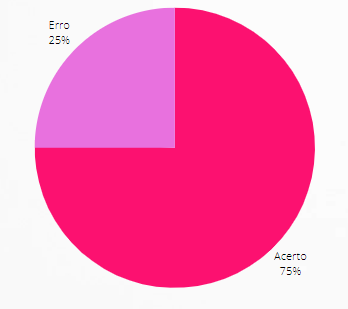

# Verificação Análise de Tarefas Concorrentes (CTT)

## 1. Introdução

&emsp;&emsp;Para verificar a [Análise de Tarefas Concorrentes](../../analiseRequisitos/AnaliseDeTarefas/analiseTarefa_CTT.md) do nosso projeto, usaremos a estratégia de "inspeções", seguindo o planejamento detalhado na página de [Planejamento da Verificação](../verificacao/planejamento.md).

## 2. Preparação

&emsp;&emsp;Para fazer a inspeção vamos utilizar um "checklist" com algumas perguntas com base nas referências utilizadas para a elaboração do artefato e os critérios de avaliação do artefato adotados na disciplina, dessa forma, poderemos analisar se este está correto com base nessas perguntas. Quando o critério for atentido, terá um "check" confirmando e quando não estiver , terá um "X" dizendo que não está correto. Conforme a legenda abaixo:

- ✅ : Atendido
- ❌ : Não Atendido

&emsp;&emsp;Além disso, após identificarmos os erros presentes no artefato, iremos consertá-los, assim produzindo uma segunda versão do artefato e da checklist.

&emsp;&emsp;A checklist definida pode ser encontrada abaixo:

|ID|Questão| Inspeção |
|-----------|-------------|-------------|
| 1  |  O documento possui introdução? ||
| 2  |  O documento possui objetivo? ||
| 3  |  Descrição do processo de como fizeram o documento? ||
| 4  |  Possui a árvore de representação do CTT? ||
| 6  |  Utiliza as relações entre tarefas no CTT corrretamente? ||
| 7  |  Apresenta representação gráfica da análise de tarefa? ||
| 8  |  Apresenta representação textual da análise de tarefa? ||
| 9  |  As tarefas estão condizentes com o site do Brasil Channel? ||
| 10 |  O documento possui conclusão? ||

<figcaption align='center'>
    <b>Tabela 1: Preparação Checklist - CTT </b>
     <small> Fonte: Elaboração Própria </small>
</figcaption>

## 3. Inspeção Análise de Tarefas Concorrentes

&emsp;&emsp;A checklist após inspeção do CTT pode ser encontrada abaixo:

|ID|Questão| Inspeção |
|-----------|-------------|-------------|
| 1  |  O documento possui introdução? | ✅ |
| 2  |  O documento possui objetivo? | ❌ |
| 3  |  Descrição do processo de como fizeram o documento? | ❌ |
| 4  |  Possui a árvore de representação do CTT? | ✅ |
| 6  |  Utiliza as relações entre tarefas no CTT corrretamente? | ✅ |
| 7  |  Apresenta representação gráfica da análise de tarefa? | ✅ |
| 8  |  Apresenta representação textual da análise de tarefa? | ❌ |
| 9  |  As tarefas estão condizentes com o site do Brasil Channel? | ✅ |
| 10 |  O documento possui conclusão? | ❌ |

<figcaption align='center'>
    <b>Tabela 2: Checklist Inspeção - CTT </b>
     <small> Fonte: Elaboração Própria </small>
</figcaption>

### 3.1 Resultados

&emsp;&emsp;A partir da inspeção do artefato verificamos que o documento não atende 4 dos critérios de avaliação definidos, dessa forma apresentando uma taxa e acertos de 60% como podemos ver a partir do gráfico abaixo:

<figcaption align='center'>
    <b>Figura 1: Gráfico resultado inspeção GOMS </b>
     <small> Fonte: Elaboração Própria </small>
</figcaption>

&emsp;&emsp;Dessa forma com o objetivo de melhorarmos a qualidade do artefato, é necessário gerar uma segunda versão.

## Historico de Versão 

|    Versão    | Alteração| Responsavel        | Revisor     | Data
| :--------: | :----: | :------------------: | :-------------: |:----:|
| 1.0 | Criação do documento | Lara | - | 21/08/2022 |

## Referências

- BARROS, André. Aula 09 - Capítulo 06 - Organização do Espaço de Problema – Livro IHC: Barbosa e Silva. Material apresentado para a disciplina de IHC no curso de Engenharia de Software da UnB, FGA.
