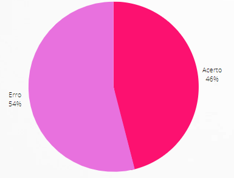
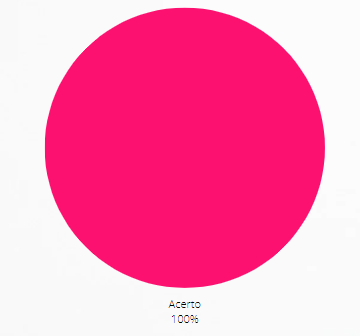

# Verificação Análise de Tarefas Hierárquicas (HTA)

## 1. Introdução

&emsp;&emsp;Para verificar a [Análise de Tarefas Hierárquicas](../../analiseRequisitos/AnaliseDeTarefas/analiseTarefas.md) do nosso projeto, usaremos a estratégia de "inspeções", seguindo o planejamento detalhado na página de [Planejamento da Verificação](../verificacao/planejamento.md).

## 2. Preparação

&emsp;&emsp;Para fazer a inspeção vamos utilizar um "checklist" com algumas perguntas com base nas referências utilizadas para a elaboração do artefato e os critérios de avaliação do artefato adotados na disciplina, dessa forma, poderemos analisar se este está correto com base nessas perguntas. Quando o critério for atentido, terá um "check" confirmando e quando não estiver , terá um "X" dizendo que não está correto. Conforme a legenda abaixo:

- ✅ : Atendido
- ❌ : Não Atendido

&emsp;&emsp;Além disso, após identificarmos os erros presentes no artefato, iremos consertá-los, assim produzindo uma segunda versão do artefato e da checklist.

&emsp;&emsp;A checklist definida pode ser encontrada abaixo:

|ID|Questão| Inspeção |
|-----------|-------------|-------------|
| 1  |  O documento possui introdução? ||
| 2  |  O documento possui objetivo? ||
| 3  |  Descrição do processo de como fizeram o documento? ||
| 4  |  Cada tarefa possui representação textual? ||
| 5  |  Cada tarefa possui representação gráfica? ||
| 6  |  Cada tarefa possui uma tabela? ||
| 7  |  As tarefas complexas estão decompostas em uma hierarquia de objetivos, subobjetivos e operações? ||
| 8  |  Cada tarefa possui uma tabela com os problemas e recomendações? ||
| 9  |  As tarefas estão condizentes com o site do Brasil Channel? ||
| 10  |  Estão identificadas as operações significativas? (Utilizando o método p x c) ||
| 11 |  O documento possui conclusão? ||

<figcaption align='center'>
    <b>Tabela 1: Preparação Checklist - HTA </b>
     <small> Fonte: Elaboração própria</small>
</figcaption>

## 3. Inspeção HTA

&emsp;&emsp;A checklist após inspeção do HTA pode ser encontrada abaixo:

|ID|Questão| Inspeção |
|-----------|-------------|-------------|
| 1  |  O documento possui introdução? | ❌ |
| 2  |  O documento possui objetivo? | ✅ |
| 3  |  Descrição do processo de como fizeram o documento? | ❌ |
| 4  |  Cada tarefa possui representação textual? | ✅  |
| 5  |  Cada tarefa possui representação gráfica? | ✅ |
| 6  |  Cada tarefa possui uma tabela? | ❌ |
| 7  |  As tarefas complexas estão decompostas em uma hierarquia de objetivos, subobjetivos e operações? | ✅ |
| 8  |  Cada tarefa possui uma tabela com os problemas e recomendações? | ❌ |
| 9  |  As tarefas estão condizentes com o site do Brasil Channel? | ✅ |
| 10 |  Estão identificadas as operações significativas? (Utilizando o método p x c) | ❌ |
| 11 |  O documento possui conclusão? | ❌ |

<figcaption align='center'>
    <b>Tabela 2: Checklist Inspeção - HTA </b>
     <small> Fonte: Elaboração própria</small>
</figcaption>

### 3.1 Resultados

&emsp;&emsp;A partir da inspeção do artefato verificamos que o documento não atende 6 dos critérios de avaliação definidos, dessa forma apresentando uma taxa e acertos de 46% como podemos ver a partir do gráfico abaixo:

<figcaption align='center'>
    <b>Figura 1: Gráfico resultado inspeção HTA </b>
     <small> Fonte: Elaboração Própria </small>
</figcaption>

&emsp;&emsp;Dessa forma com o objetivo de melhorarmos a qualidade do artefato, geramos uma segunda versão do mesmo cumprindo com os critérios da checklist.

## 4. Inspeção HTA Versão 2

&emsp;&emsp;A checklist após inspeção da HTA pode ser encontrada abaixo:

|ID|Questão| Inspeção |
|-----------|-------------|-------------|
| 1  |  O documento possui introdução? | ✅ |
| 2  |  O documento possui objetivo? | ✅ |
| 3  |  Descrição do processo de como fizeram o documento? | ✅ |
| 4  |  Cada tarefa possui representação textual? | ✅  |
| 5  |  Cada tarefa possui representação gráfica? | ✅ |
| 6  |  Cada tarefa possui uma tabela? | ✅ |
| 7  |  As tarefas complexas estão decompostas em uma hierarquia de objetivos, subobjetivos e operações? | ✅ |
| 8  |  Cada tarefa possui uma tabela com os problemas e recomendações? | ✅ |
| 9  |  As tarefas estão condizentes com o projeto? | ✅ |
| 10 |  Estão identificadas as operações significativas? (Utilizando o método p x c) | ✅ |
| 11 |  O documento possui conclusão? | ✅ |

<figcaption align='center'>
    <b>Tabela 2: Checklist Inspeção - HTA Versão 2 </b>
     <small> Fonte: Elaboração própria</small>
</figcaption>

### 4.1 Resultados

&emsp;&emsp;A partir da inspeção do artefato verificamos que o documento atende todos os critérios de avaliação definidos, dessa forma apresentando uma taxa e acertos de 100% como podemos ver a partir do gráfico abaixo:

<figcaption align='center'>
    <b>Figura 2: Gráfico resultado inspeção HTA </b>
     <small> Fonte: Elaboração Própria </small>
</figcaption>

&emsp;&emsp;Desta forma, decidimos que no momento não havia a necessidade de ser gerada uma terceira versão do artefato.

## Historico de Versão 

|    Versão    | Alteração| Responsavel        | Revisor     | Data
| :--------: | :----: | :------------------: | :-------------: |:----:|
| 1.0 | Criação do documento | Lara | Lucas | 21/08/2022 |
| 1.1 | Correção da checklist | Lara | - | 05/09/2022 |
| 1.2 | Documento Revisado | Lucas | - | 10/09/2022 |

## Referências

- BARROS, André. Aula 09 - Capítulo 06 - Organização do Espaço de Problema – Livro IHC: Barbosa e Silva. Material apresentado para a disciplina de IHC no curso de Engenharia de Software da UnB, FGA.
