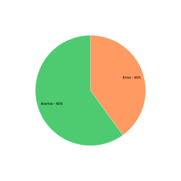

# Verificação Resultado da Avaliação Protótipo Baixa Fidelidade

## 1. Introdução

&emsp;&emsp;Neste documento iremos fazer a verificação do [Relato dos Resultados da Avaliação do Protótipo de Papel](../prototipo_papel_doc/resultadoAvaliPropPapel.md) do nosso projeto, usaremos a estratégia de "inspeções", seguindo o planejamento detalhado na página de [Planejamento da Verificação](../verificacao/planejamento.md)

## 2. Preparação

&emsp;&emsp;Para fazer a inspeção vamos utilizar um "checklist" com algumas perguntas com base nas referências utilizadas para a elaboração do artefato e os critérios de avaliação do artefato adotados na disciplina, dessa forma, poderemos analisar se este está correto com base nessas perguntas. Quando o critério for atentido, terá um "check" confirmando e quando não estiver, terá um "X" dizendo que não está correto. Conforme a legenda abaixo:

- ✅ : Atendido
- ❌ : Não Atendido

&emsp;&emsp;Além disso, após identificarmos os erros presentes no artefato, iremos consertá-los, assim produzindo uma segunda versão do artefato e da checklist.

&emsp;&emsp;A checklist, definida com base no livro Interação Humano Computador de Simone Barbosa, pode ser encontrada abaixo:

|ID|Questão| Inspeção |
|-----------|-------------|-------------|
| 1 | O documento apresenta os objetivos da avaliação? ||
| 2 | O documento apresenta o número e o perfil de avaliadores e aprticipantes? ||
| 3 | São apresentadas as tarefas realizadas pelos participantes? ||
| 4 | É apresentada uma tabela de correções para o protótipo? ||
| 5 | São respondidas as perguntas definidas no planejamento da avaliação? ||

<figcaption align='center'>
    <b>Tabela 1: Preparação checklist Resultado Avaliação Protótipo de Papel </b>
     <small> Fonte: Elaboração Própria </small>
</figcaption>

## 3. Inspeção Avaliação Protótipo de Papel
&emsp;&emsp;A checklist após inspeção do Relato do Resultado da Avaliação Protótipo de Papel pode ser encontrada abaixo:

|ID|Questão| Inspeção |
|-----------|-------------|-------------|
| 1 | O documento apresenta os objetivos da avaliação? |✅|
| 2 | O documento apresenta o número e o perfil de avaliadores e aprticipantes? |✅|
| 3 | São apresentadas as tarefas realizadas pelos participantes? |✅|
| 4 | É apresentada uma tabela de correções para o protótipo? |❌|
| 5 | São respondidas as perguntas definidas no planejamento da avaliação? |❌|

<figcaption align='center'>
    <b>Tabela 2: checklist inspeção Resultado Avaliação Protótipo de Papel  </b>
     <small> Fonte: Elaboração Própria</small>
</figcaption>

### 3.1 Resultados
&emsp;&emsp; A partir da inspeção do artefato verificamos que o documento atende os 3 dos 5 critérios de avaliação definidos, dessa forma apresentando uma taxa e acertos de 60% como podemos ver a partir do gráfico abaixo:

<figcaption align='center'>
    <b>Figura 1: Gráfico resultado inspeção Avaliação Protótipo de Papel </b>
     <small> Fonte: Elaboração Própria </small>
</figcaption>

&emsp;&emsp; Dessa forma, foram feitos os devidos ajustes no documento para que ele atendesse os 5 critérios de avaliação, assim chegando à 100% de taxa de acertos.

## Histórico de Versão 

|    Versão    | Alteração| Responsavel        | Revisor     | Data
| :--------: | :----: | :------------------: | :-------------: |:----:|
| 1.0| Criação do documento | Lucas | Lara | 10/09/2022 |

## Referências
- BARBOSA, Simone; DINIZ, Bruno. Interação Humano-Computador, Editora Elsevier, Rio de Janeiro, 2010.