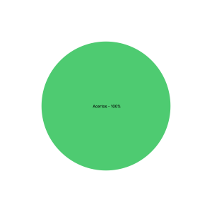

# Verificação das Personas

## 1. Introdução

&emsp;&emsp;Para verificar as [personas](../analiseRequisitos/personas.md) do nosso projeto, usaremos a estratégia de "inspeções", seguindo o planejamento detalhado na página de [Planejamento da Verificação](../verificacao/planejamento.md)

## 2. Preparação

&emsp;&emsp; Para fazer a inspeção vamos utilizar um "checklist" com algumas perguntas com base nas referências utilizadas para a elaboração do artefato e os critérios de avaliação do artefato adotados na disciplina, dessa forma, poderemos analisar se este está correto com base nessas perguntas. Quando o critério for atentido, terá um "check" confirmando e quando não estiver , terá um "X" dizendo que não está correto. Conforme a legenda abaixo:

- ✅ : Atendido
- ❌ : Não Atendido

&emsp;&emsp;Além disso, após identificarmos os erros presentes no artefato, iremos concertá-los, assim produzindo uma segunda versão do artefato e da checklist.

&emsp;&emsp;A checklist definida pode ser encontrada abaixo:

|ID|Questão| Inspeção |
|-----------|-------------|-------------|
| 1 | Foi definido o Elenco de Personas? ||
| 2 | Foi definido quantas personas e qual a razão desse número?||
| 3 | Foram definidos Cenários?||
| 4 | As personas descrevem um usuário típico?||
| 5 | As personas possuem um objetivo?||
| 6 | As personas possuem identidade?||
| 7 | As personas possuem um status?||
| 8 | As personas possuem requisitos?||
| 9 | As personas possuem um relacionamento?||
| 10 | Possui as tarefas das personas?||

<figcaption align='center'>
    <b>Tabela 1: Preparação checklist Avaliação Protótipo de Papel </b>
     <small> Fonte: Elaboração própria</small>
</figcaption>

## 3. Inspeção Planejamento Avaliação Protótipo de papel

&emsp;&emsp;A checklist após inspeção da [versão 1 do Planejamento Avaliação Protótipo de papel](../prototipo_papel_doc/PlanejamentoAvaliPropPapel.md) pode ser encontrada abaixo:

|ID|Questão| Inspeção |
|-----------|-------------|-------------|
| 1 | Foi definido o elenco de Personas? | ✅ |
| 2 | Quantas personas e qual a razão desse número?|✅|
| 3 | Foram definidos Cenários?|✅|
| 4 | As personas descrevem um usuário típico?|✅|
| 5 | As personas possuem um objetivo?|✅|
| 6 | As personas possuem identidade?|✅|
| 7 | As personas possuem um status?|✅|
| 8 | As personas possuem requisitos?|✅|
| 9 | As personas possuem um relacionamento?|✅|
| 10 | Possui as tarefas das personas?|✅|

<figcaption align='center'>
    <b>Tabela 2: Checklist da inspeção da Avaliação Protótipo de Papel </b>
     <small> Fonte: Elaboração própria</small>
</figcaption>

## 3.1 Resultados da inspeção
&emsp;&emsp; A partir da inspeção do artefato verificamos que o documento atende com 10 dos critérios de avaliação definidos, dessa forma apresentando uma taxa e acertos de 100% como podemos ver a partir do gráfico abaixo:

<figcaption align='center'>
    <b>Figura 2: Gráfico Planejamento Avaliação Protótipo de papel V2 </b>
     <small> Fonte: Elaboração Própria </small>
</figcaption>

&emsp;&emsp; A partir da inspeção do artefato verificamos que o documento atendia com todos os critérios de avaliação definidos na checklist, não precisando ser modificado ou alterado.

## Historico de Versão 

|    Versão    | Alteração| Responsavel        | Revisor     | Data
| :--------: | :----: | :------------------: | :-------------: |:----:|
| 1.0| Criação do documento | Samuel | - | 21/08/2022 |
| 1.1| Adição de conteúdo | Samuel | - | 22/08/2022 |

## Referências

- SERRANO, Maurício; SERRANO, Milene. Requisitos - Aula 23. 1º/2022. Material apresentado para a disciplina de IHC no curso de Engenharia de Software da UnB, FGA.

- BARROS, André. Aula 16 – Atividade de Conteúdo ( Individual): Resumo da aula 16: Apresentação do projeto etapa 4: Planejamento da Avaliação do Storyboard e Análise de tarefas e planejamento do relato dos resultados da avaliação do Storyboard e Análise de tarefas. Material apresentado para a disciplina de IHC no curso de Engenharia de Software da UnB, FGA.

- BARBOSA, Simone; DINIZ, Bruno. Interação Humano-Computador, Editora Elsevier, Rio de Janeiro, 2010. 