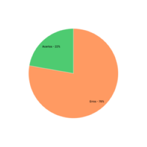

# Verificação Planejamento da Avaliação do Protótipo de Papel

## 1. Introdução

&emsp;&emsp;Para verificar o [Planejamento da Avaliação do Protótipo de Papel](../prototipo_papel_doc/PlanejamentoAvaliPropPapel.md) do nosso projeto, usaremos a estratégia de "inspeções", seguindo o planejamento detalhado na página de [Planejamento da Verificação](../verificacao/planejamento.md)

## 2. Preparação

&emsp;&emsp;Para fazer a inspeção vamos utilizar um "checklist" com algumas perguntas com base nas referências utilizadas para a elaboração do artefato e os critérios de avaliação do artefato adotados na disciplina, dessa forma, poderemos analisar se este está correto com base nessas perguntas. Quando o critério for atentido, terá um "check" confirmando e quando não estiver , terá um "X" dizendo que não está correto. Conforme a legenda abaixo:

- ✅ : Atendido
- ❌ : Não Atendido

&emsp;&emsp;Além disso, após identificarmos os erros presentes no artefato, iremos consertá-los, assim produzindo uma segunda versão do artefato e da checklist.

&emsp;&emsp;A checklist definida pode ser encontrada abaixo:

|ID|Questão| Inspeção |
|-----------|-------------|-------------|
| 1 | São apresentados os objetivos claros para a avaliação? ||
| 2 | São apresentadas perguntas a serem respondidas com a avaliação?||
| 3 | Apresenta os métodos de avaliação a serem utilizados?||
| 4 | Apresenta informações sobre o perfil dos usuários que participarão das entrevistas?||
| 5 | Apresenta o número de usuários que partciparão da avaliação e a razão deste número?||
| 6 | Apresenta informações sobre as questões éticas?||
| 7 | Apresenta um cronograma para a realização da avaliação?||
| 8 | Apresenta o que o avaliador deve realizar durante a avaliação?||
| 9 | Apresenta planejamento para realização de um teste piloto?||

<figcaption align='center'>
    <b>Tabela 1: Preparação checklist Avaliação Protótipo de Papel </b>
     <small> Fonte: Tabela de considerações da apresentação da etapa 4 da disciplina de IHC(Adaptado)</small>
</figcaption>

## 3. Inspeção Planejamento Avaliação Protótipo de papel

&emsp;&emsp;A checklist após inspeção da [versão 1 do Planejamento Avaliação Protótipo de papel](../prototipo_papel_doc/PlanejamentoAvaliPropPapel.md) pode ser encontrada abaixo:

|ID|Questão| Inspeção |
|-----------|-------------|-------------|
| 1 | São apresentados os objetivos claros para a avaliação? | ❌ |
| 2 | São apresentadas perguntas a serem respondidas com a avaliação?|❌|
| 3 | Apresenta os métodos de avaliação a serem utilizados?|❌|
| 4 | Apresenta informações sobre o perfil dos usuários que participarão das entrevistas?|✅|
| 5 | Apresenta o número de usuários que partciparão da avaliação e a razão deste número?|❌|
| 6 | Apresenta informações sobre as questões éticas?|❌|
| 7 | Apresenta um cronograma para a realização da avaliação?|❌|
| 8 | Apresenta o que o avaliador deve realizar durante a avaliação?|❌|
| 9 | Apresenta planejamento para realização de um teste piloto?|✅|

<figcaption align='center'>
    <b>Tabela 2: Checklist da inspeção da Avaliação Protótipo de Papel </b>
     <small> Fonte: Tabela de considerações da apresentação da etapa 4 da disciplina de IHC(Adaptado)</small>
</figcaption>

### 3.1 Resultados da inspeção
&emsp;&emsp;A partir da inspeção do artefato verificamos que o documento não atende 7 dos critérios de avaliação definidos, dessa forma apresentando uma taxa e acertos de 22% como podemos ver a partir do gráfico abaixo:

<figcaption align='center'>
    <b>Figura 1: Gráfico Planejamento Avaliação Protótipo de papel V1 </b>
     <small> Fonte: Elaboração Própria </small>
</figcaption>

&emsp;&emsp;Dessa forma com o objetivo de melhorarmos a qualidade do artefato, geramos uma segunda versão do mesmo cumprindo com os critérios da checklist.

## 4. Inspeção Planejamento Avaliação Protótipo de papel V2
&emsp;&emsp; A versão 2 da checklist com os critérios de avaliação pode ser encontrado abaixo: 

|ID|Questão| Inspeção |
|-----------|-------------|-------------|
| 1 | São apresentados os objetivos claros para a avaliação? |✅|
| 2 | São apresentadas perguntas a serem respondidas com a avaliação?|✅|
| 3 | Apresenta os métodos de avaliação a serem utilizados?|✅|
| 4 | Apresenta informações sobre o perfil dos usuários que participarão das entrevistas?|✅|
| 5 | Apresenta o número de usuários que partciparão da avaliação e a razão deste número?|✅|
| 6 | Apresenta informações sobre as questões éticas?|✅|
| 7 | Apresenta um cronograma para a realização da avaliação?|✅|
| 8 | Apresenta o que o avaliador deve realizar durante a avaliação?|✅|
| 9 | Apresenta planejamento para realização de um teste piloto?|✅|

<figcaption align='center'>
    <b>Tabela 3: Checklist da inspeção da Avaliação Protótipo de Papel V2</b>
     <small> Fonte: Tabela de considerações da apresentação da etapa 4 da disciplina de IHC(Adaptado)</small>
</figcaption>

### 4.1 Resultados da inspeção V2
&emsp;&emsp;A partir da inspeção da segunda versão do artefato verificamos que o documento atende com todos os critérios de avaliação definidos na checklist, como pode ser obervado a partir do gráfico abaixo:

<figcaption align='center'>
    <b>Figura 2: Gráfico Planejamento Avaliação Protótipo de papel V2 </b>
     <small> Fonte: Elaboração Própria </small>
</figcaption>

## Historico de Versão 

|    Versão    | Alteração| Responsavel        | Revisor     | Data
| :--------: | :----: | :------------------: | :-------------: |:----:|
| 1.0| Criação do documento | Lucas | Lara | 16/08/2022 |

## Referências

- SERRANO, Maurício; SERRANO, Milene. Requisitos - Aula 23. 1º/2022. Material apresentado para a disciplina de IHC no curso de Engenharia de Software da UnB, FGA.

- BARROS, André. Aula 16 – Atividade de Conteúdo (Individual): Resumo da aula 16: Apresentação do projeto etapa 4: Planejamento da Avaliação do Storyboard e Análise de tarefas e planejamento do relato dos resultados da avaliação do Storyboard e Análise de tarefas. Material apresentado para a disciplina de IHC no curso de Engenharia de Software da UnB, FGA.