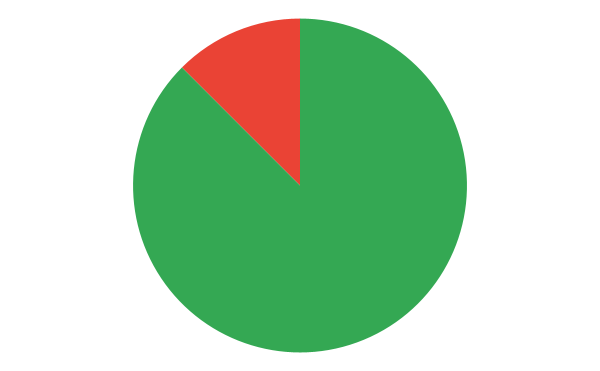
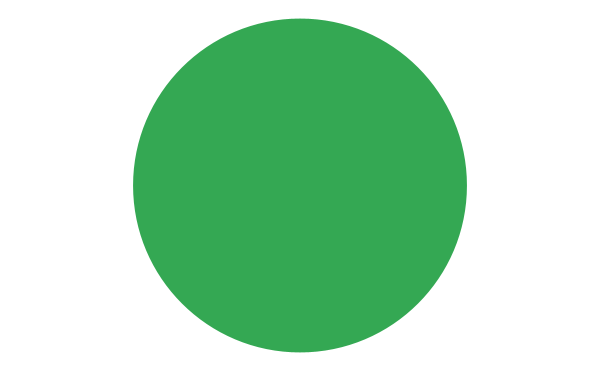

# Verificação Princípios Gerais

## 1. Introdução

&emsp;&emsp;Para a verificação dos [Princípios Gerais](../analiseRequisitos/principiosGerais.md) do nosso projeto, usaremos a estratégia de "inspeções", seguindo o planejamento detalhado na página de [Planejamento da Verificação](../verificacao/planejamento.md)

## 2. Preparação

&emsp;&emsp;Para fazer a inspeção vamos utilizar um "checklist" com algumas perguntas com base nas referências utilizadas para a elaboração do artefato e os critérios de avaliação do artefato adotados na disciplina, dessa forma, poderemos analisar se este está correto com base nessas perguntas. Quando o critério for atentido, terá um "check" confirmando e quando não estiver, terá um "X" dizendo que não está correto. Conforme a legenda abaixo:

- ✅ : Atendido
- ❌ : Não Atendido

&emsp;&emsp;Além disso, após identificarmos os erros presentes no artefato, iremos consertá-los, assim produzindo uma segunda versão do artefato e da checklist.

&emsp;&emsp;A checklist definida pode ser encontrada abaixo:

|ID|Questão| Inspeção |
|-----------|-------------|-------------|
| 1 | O artefato de princípios gerais apresenta uma introdução? | |
| 2 | É apresentado de onde foi retirado os princípios? ||
| 3 | É apresentado quais princípios serão utilizados no projeto? ||
| 4 | Contém informações bem explicadas e breves de cada princípio? ||
| 5 |  É apresentado como os Princípios Gerais do Projeto serão utilizados no projeto?||
| 6 | Os tópicos foram explicados corretamente? ||
| 7 | Possui todas as informações necessárias? ||
| 8 | É apresentado uma conclusão do artefato? ||

<figcaption align='center'>
    <b>Tabela 1: Preparação checklist Princípios Gerais </b>
     <small> Fonte: Elaboração Própria </small>
</figcaption>

## 3. Inspeção Princípios Gerais
&emsp;&emsp;A checklist após inspeção dos princípios gerais pode ser encontrada abaixo:

|ID|Questão| Inspeção |
|-----------|-------------|-------------|
| 1 | O artefato de princípios gerais apresenta uma introdução? |✅ |
| 2 | É apresentado os princípios? |✅|
| 3 | É apresentado quais princípios serão utilizados no projeto? |❌|
| 4 | Contém informações bem explicadas e breves de cada princípio? |✅|
| 5 |  É apresentado como os Princípios Gerais do Projeto serão utilizados no projeto?|✅|
| 6 | Os tópicos foram explicados corretamente? |✅|
| 7 | Possui todas as informações necessárias? |✅|
| 8 | É apresentado uma conclusão do artefato? |✅|

<figcaption align='center'>
    <b>Tabela 2: checklist inspeção Princípios Gerais </b>
     <small> Fonte: Elaboração Própria</small>
</figcaption>

### 3.1 Resultados
&emsp;&emsp; A partir da inspeção do artefato verificamos que o documento não atende 1 dos critérios de avaliação definidos, dessa forma apresentando uma taxa e acertos de 87,5% como podemos ver a partir do gráfico abaixo:

<figcaption align='center'>
    <b>Figura 1: Gráfico resultado inspeção Princípios Gerais </b>
     <small> Fonte: Elaboração Própria </small>
</figcaption>

&emsp;&emsp; Dessa forma com o objetivo de melhorarmos a qualidade do artefato, geramos uma segunda versão do mesmo cumprindo com os critérios da checklist.

## 4. Inspeção Planejamento Avaliação Protótipo de papel V2
&emsp;&emsp; A versão 2 da checklist com os critérios de avaliação pode ser encontrado abaixo: 

|ID|Questão| Inspeção |
|-----------|-------------|-------------|
| 1 | O artefato de princípios gerais apresenta uma introdução? |✅ |
| 2 | É apresentado os princípios? |✅|
| 3 | É apresentado quais princípios serão utilizados no projeto? |✅|
| 4 | Contém informações bem explicadas e breves de cada princípio? |✅|
| 5 |  É apresentado como os Princípios Gerais do Projeto serão utilizados no projeto?|✅|
| 6 | Os tópicos foram explicados corretamente? |✅|
| 7 | Possui todas as informações necessárias? |✅|
| 8 | É apresentado uma conclusão do artefato? |✅|

<figcaption align='center'>
    <b>Tabela 3: checklist inspeção Princípios Gerais V2 </b>
     <small> Fonte: Elaboração Própria</small>
</figcaption>

### 4.1 Resultados da inspeção V2
&emsp;&emsp;A partir da inspeção da segunda versão do artefato verificamos que o documento atende com todos os critérios de avaliação definidos na checklist, como pode ser obervado a partir do gráfico abaixo:

<figcaption align='center'>
    <b>Figura 2: Gráfico principios Gerais V2 </b>
     <small> Fonte: Elaboração Própria </small>
</figcaption>

## Histórico de Versão 

|    Versão    | Alteração| Responsavel        | Revisor     | Data
| :--------: | :----: | :------------------: | :-------------: |:----:|
| 1.0| Criação do documento | Samuel | Lucas | 21/08/2022 |
| 1.1| Arquivo revisado| Lucas | - | 22/08/2022 |
## Referências

- SERRANO, Maurício; SERRANO, Milene. Requisitos - Aula 23. 1º/2022. Material apresentado para a disciplina de IHC no curso de Engenharia de Software da UnB, FGA.

- BARROS, André. Aula 14 – Atividade de Avaliativa ( Individual): Resumo da "Apresentação do projeto etapa 3: Princípios Gerais de Projeto, Metas de usabilidade, Guia de Estilo. (Fase: análise de requisitos)"

- BARBOSA, Simone; DINIZ, Bruno. Interação Humano-Computador, Editora Elsevier, Rio de Janeiro, 2010.
