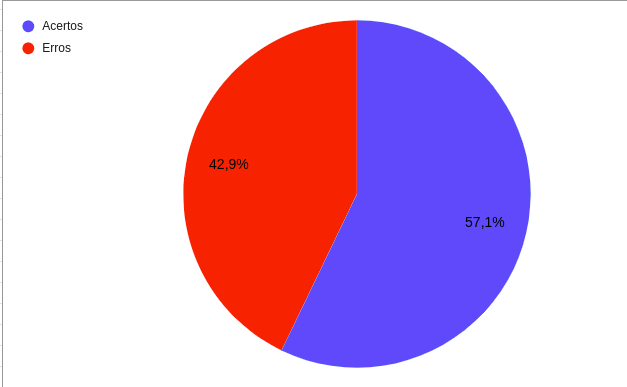

# Verificação Metas de Usabilidade

## 1. Introdução
  
&emsp;&emsp;Para verificar o artefato [Metas de Usabilidade](../analiseRequisitos/metas_Usabilidade.md) do projeto, usamos a estratégia de "Inspeção", seguindo o planejamento detalhado na página de [Planejamento de Verificação](planejamento.md).  

## 2. Preparação
  
&emsp;&emsp;A inspeção foi realizada utilizando um "checklist" com perguntas fundamentadas nas referências utilizadas para a elaboração do artefato e dos critérios de avaliação adotados na disciplina. Dessa forma, analisamos se este documento está correto com base nessas perguntas.  

&emsp;&emsp;Quando o critério for satisfeito, terá um "check" confirmando e quando não for satisfeito, terá um "X" dizendo que não está correto. Conforme a legenda a seguir:  

- ✅ : Atendido
- ❌ : Não Atendido  

&emsp;&emsp;Além disso, após a identificação dos erros presentes no artefato, os aterfatos foram consertados, assim produzindo uma segunda versão do artefato e da checklist.  

&emsp;&emsp;A seguir a tabela 2.1 apresenta as perguntas que foram utilizadas para avaliar o artefato:  
  

|ID|Questão| Inspeção |
|-----------|-------------|-------------|
| 1 | O documento possui uma introdução? ||
| 2 | O documento possui uma conclusão? ||
| 3 | O documento possui histórico de versionamento? ||
| 4 | O documento possui referências? ||
| 5 | As tabelas e imagens estão referenciadas? ||
| 6 | As tabelas e imagens são chamadas no texto? ||
| 7 | Ficou claro a definição das Metas de Usabilidade? ||
| 8 | Ficou claro o objetivo da aplicação das Metas no site? ||
| 9 | É explicado a razão de quais das metas de usabilidade serão utilizadas? ||
  

  
<figcaption align='center'>
    <b>Tabela 2.1: Preparação checklist Metas de Usabilidade </b>
     <small> Fonte: Elaboração prórpia e adição de uma pergunta da tabela de considerações da apresentação da etapa 3 da disciplina de IHC</small>
</figcaption>
  

## 3. Inspeção e Resultados  
  
&emsp;&emsp;Neste tópico é apresentado a checklist respondida da inspeção do artefato e a checklist da inspeção do artefato corrigido.   

### 3.1. Inspeção do artefato Metas de Usabilidade
  
&emsp;&emsp;Segue a tabela 3.1.1 apresentando a checklist respondida da inspeção do artefato:
  

|ID|Questão| Inspeção |
|-----------|-------------|-------------|
| 1 | O documento possui uma introdução? |✅|
| 2 | O documento possui uma conclusão? |❌|
| 3 | O documento possui histórico de versionamento? |✅|
| 4 | O documento possui referências? |✅|
| 5 | Ficou claro a definição das Metas de Usabilidade? |✅|
| 6 | Ficou claro o objetivo da aplicação das Metas no site? |❌|
| 7 | É explicado a razão de quais das metas de usabilidade serão utilizadas? |❌|
  

  
<figcaption align='center'>
    <b>Tabela 3.1.1: Checklist da inspeção da Metas de Usabilidade </b>
     <small> Fonte: Elaboração prórpia e adição de uma pergunta da tabela de considerações da apresentação da etapa 3 da disciplina de IHC</small>
</figcaption>

### 3.2. Resultados da Insepção
  
&emsp;&emsp;A partir da inspeção do artefato, verficamos que o documento não satisfazia 3 dos critérios definidos para a avaliação, dessa forma apresentando uma taxa de acertos de 57,1%, como é apresentado na figura 3.2.1:  
  

<figcaption align='center'>
    <b>Figura 3.2.1: Gráfico da Checklist Respondida da Inspeção do Artefato Metas de Usablidade </b>
     <small> Fonte: Elaboração Própria </small>
</figcaption>

&emsp;&emsp;Dessa forma, há necessidade de construir uma segunda versão do documento de metas de usabilidade.

## Historico de Versão 

|    Versão    | Alteração| Responsavel        | Revisor     | Data
| :--------: | :----: | :------------------: | :-------------: |:----:|
| 1.0| Criação do documento | Levi | - | 22/08/2022 |
| 1.1| Adição dos tópicos 1, 2, 3.1 e 3.2 | Levi | - | 22/08/2022 |

## Referências

- SERRANO, Maurício; SERRANO, Milene. Requisitos - Aula 23. 1º/2022. Material apresentado para a disciplina de IHC no curso de Engenharia de Software da UnB, FGA.